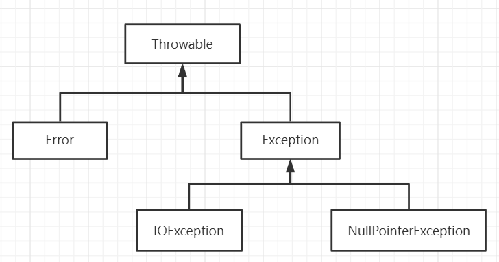
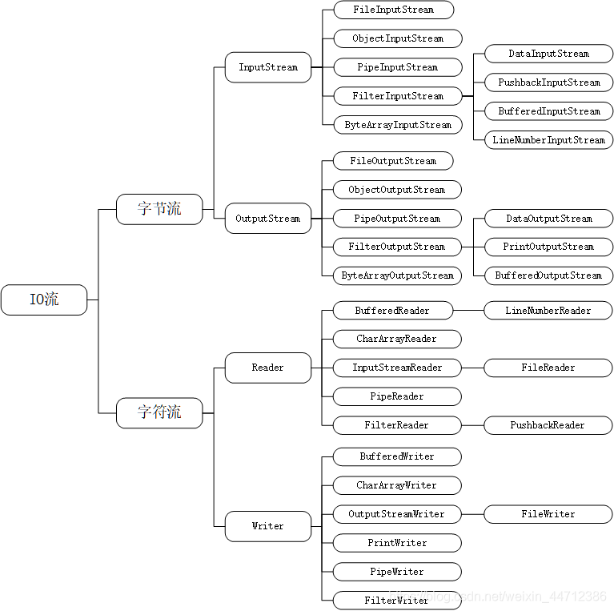
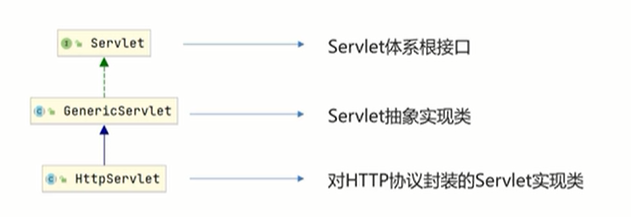

# java基础
样例

```java
public class Main {
    public static void main(String[] args) {
    
    }
}
```


## 注释
```java
// 单行
/**/多行
```
## 接口

比较器 Comparator 和 Comparable
```java
Collections.sort(list,new Comparator<Integer>(){
    @Override
    public int compare(Integer o1, Integer o2) {
        return o1-o2;
    }

});

class Student implements Comparable<Student>
{
    private int age;
    @Override
    public int compareTo(Student s) {
        if (this.age > s.age)
            return 1;
        else
            return 0;
    }
}

```

### lambda表达式
```java
Collections.sort(list,(s1,s2)->s1.length() - s2.length()); //简化接口内部函数的实现
```
## 异常、断言和日志

### 断言


```java
assert x > 0 : x; 判断 x 是否大于 0，否 将x的实际值传递给AssertionError对象
```

### 异常处理
```java
try{
    原来要执行的
}catch(Exception e)
{
    e.printStackTrace();
}
finally{
    最终要执行的步骤
}
// 函数中用 throws 抛出异常
public void slove throws Exception(){
    
}
代码块中用throw
throw new IOExcption();
```
## 集合与数组的转换

```java
String[] values = new String[5];

HashSet<String> set = new HashSet(Arrays.asList(values));

String[] vallues = set.toArray(new String[set.size()]);
```

## 异常

### 异常分类



Error 和 Exception

### 处理异常

1. throws 用于函数
2. throw 用于代码块
3. try catch finally

### 创建自己的异常

```java
class MyException extends Exxception
{
	public MyException(){}
    public MyException(String msg){
    	super(msg);
    }
}
```

由于sqrt方法的声明中有throws关键字，所以，在调用该方法时，必须对throws后面声明的异常进行处置，处置的方法有两种：
    （1）main方法处理该异常，使用try.....catch语句，将可能会出现的异常的代码放在try块内，将处理异常的代码放在catch块内，并指明catch能够捕获的异常的类型，当异常被捕获时，执行catch块内的语句。
    （2）main方法不处理该异常，将异常向外层程序抛出。在方法声明中使用throws关键字抛出异常，方法体中不需要使用try...catch语句。

### 三种方法的使用

关键字:throw,throws,try和catch的用法如下：    1、throws出现在方法的声明中，表示该方法可能会抛出的异常，允许throws后面跟着多个异常类型    2、throw出现在方法体中，用于抛出异常。当方法在执行过程中遇到异常情况时，将异常信息封装为异常对象，然后throw。    3、try出现在方法体中，它自身是一个代码块，表示尝试执行代码块的语句。如果在执行过程中有某条语句抛出异常，那么代码块后面的语句将不被执行。    4、catch出现在try代码块的后面，自身也是一个代码块，用于捕获异常try代码块中可能抛出的异常。catch关键字后面紧接着它能捕获的异常类型，所有异常类型的子类异常也能被捕获。


## IO

 

### 流的分类

按照读取方向分：输入输出

按照读取方式分：字符和字节

字节输入流  java.io.InputStream    硬盘到内存 

字节输出流  java.io.OutputStream 内存到硬盘 

字符输入流	 java.io.Reader	 只能读取文本文件 

字符输出流      java.io.Writer	 可以读取多种形式的文件 如文本文档 图片声音视频

字符流和字节流的辨别方法 在于结尾单词

以上流都实现了 java.io.Closeable接口，都是可关闭的，有close()方法

输出流使用完毕后需要更新，关闭以节省资源。

所有输出流都实现了 java.io.Flushable接口，都是可刷新的，有flush()方法。

### 常用需掌握的流

```java
文件专属
java.io.FileInputStream
java.io.FileOutputStream
java.io.FileReader
java.io.FileWriter

转换流 （将字节流转换成字符流）
java.io.InputStreamReader
java.io.OutputStreamWriter

缓冲流专属
java.io.BufferedReader
java.io.BufferedWriter
java.io.BufferedInputStream
java.io.BufferedOutputStream

数据流专属
java.io.DataInputStream
java.io.DataOutputStream

对象专属流
java.io.ObjectInputStream
java.io.ObjectOutputStream

标准输出流
java.io.PrintWriter
java.io.PrintStream
```


### File类

什么是file？文件和目录名的抽象表示形式

主要用于文件和目录的创建 获取目录中的文件 判断文件 目录 获取文件和目录的信息（如大小和修改时间）

File一般与Stream 和 Writer配合使用

```java
public FileOutputStream(File file) throws FileNotFoundException {
       this(file, false);
}
一般就是构造方法中的参数是File对象
```

## 线程

### 线程创建的四种方式

继承Thread类

实现Runnable接口

实现Callable接口，用FutureTask包装

线程池创建线程

```java
        // 继承Thread类
		MyThread myThread = new MyThread();
        myThread.start();
		
		// 实现Runnable接口
        Thread oneThread = new Thread(new OneThread());
        oneThread.start();

		// 实现Callable接口，用FutureTask包装
        CallableThread ctt = new CallableThread();
        FutureTask<Integer> ft = new FutureTask<>(ctt);
        new Thread(ft,"hasvalue").start();
        System.out.println(ft.get());

        // 使用线程组 管理线程
        ThreadGroup threadGroup = new ThreadGroup("groups");
        threadGroup.list();
        ThreadSyn threadSyn = new ThreadSyn();
        Thread t1 = new Thread(threadSyn,"t1");
        Thread t2 = new Thread(threadSyn,"t2");
        t1.start();
        t2.start();

		// 线程池创建线程
        ThreadPoolExecutor threadPoolExecutor = new ThreadPoolExecutor(60,100,1, SECONDS,new ArrayBlockingQueue<>(50));
        threadPoolExecutor.execute(new Thread());
	参数 核心线程 最大线程 存活时间 阻塞队列
```


### 线程同步

线程不安全的原因

不同的线程同时对同一个数据进行修改，造成数据混乱和不一致性的出现

解决方法

sychronized同步代码块

sychronized同步方法

```java
import java.util.concurrent.locks.Lock;
import java.util.concurrent.locks.ReentrantLock;
import java.util.concurrent.locks.ReentrantReadWriteLock;
public class ThreadSychronized {


    public static void main(String[] args) {
        Account account = new Account(100,"lll");
        Drawing d1 = new Drawing(account,80,"fe");
        Drawing d2 = new Drawing(account,50,"ma");
        d1.start();
        d2.start();
    }
}

class Account
{
    int money;
    String name;

    public Account(int money,String name)
    {
        this.money = money;
        this.name = name;
    }
}

class Drawing extends Thread
{
    Account acount;
    int drawing;
    int nowMoney;


    public Drawing(Account account,int drawing,String name)
    {
        super(name);
        this.acount = account;
        this.drawing = drawing;


    }
    public void run(){
        synchronized(acount){
            if(acount.money - drawing < 0)
            {
                System.out.println(Thread.currentThread().getName()+"钱不够用了");
                return;
            }
            try{
                Thread.sleep(1000);
                acount.money = acount.money - drawing;
                nowMoney = nowMoney + drawing;
            }catch(InterruptedException e)
            {
                e.printStackTrace();
            }
            System.out.println(acount.name+"余下 " + acount.money);
            System.out.println(this.getName()+"手里的钱" + nowMoney);
        }
    }
}

```

Lock接口

```java
class TestLock implements Runnable
{
    int tickets = 10;
    private final ReentrantLock lock = new ReentrantLock();
    public void run(){
        while(true)
        {
            try
            {
                lock.lock();
                if(tickets > 0)
                {
                    try{
                        Thread.sleep(1000);
                    }catch (InterruptedException e)
                    {
                        e.printStackTrace();
                    }
                    System.out.println("ticket has "+ tickets--);
                }else {
                    break;
                }
            }finally {
                lock.unlock();

            }
        }
    }
}

```

可重入锁：

可重入 就是说某个线程已经获得某个锁，可以再次获取锁而不会出现死锁。可重入锁主要用在线程需要多次进入临界区代码时，需要使用可重入锁。

读写锁

ReentrantReadWriteLock

可分为读锁和写锁

读可以同时读 读时不可写

写时不可读 写

### fork -join 框架

ForkJoinPool由ForkJoinTask数组和ForkJoinWorkerThread数组组
成，ForkJoinTask数组负责将存放程序提交给ForkJoinPool的任务，⽽
ForkJoinWorkerThread数组负责执⾏这些任务。

Fork/Join框架提供了以下两个⼦类。
·RecursiveAction：⽤于没有返回结果的任务。
·RecursiveTask：⽤于有返回结果的任务。
②ForkJoinPool：ForkJoinTask需要通过ForkJoinPool来执⾏。
任务分割出的⼦任务会添加到当前⼯作线程所维护的双端队列
中，进⼊队列的头部。当⼀个⼯作线程的队列⾥暂时没有任务时，它
会随机从其他⼯作线程的队列的尾部获取⼀个任务。
#### 工作窃取算法
⼯作窃取（work-stealing）算法是指某个线程从其他队列⾥窃取任
务来执⾏。那么，为什么需要使⽤⼯作窃取算法呢？假如我们需要做
⼀个⽐较⼤的任务，可以把这个任务分割为若⼲互不依赖的⼦任务，
为了减少线程间的竞争，把这些⼦任务分别放到不同的队列⾥，并为
每个队列创建⼀个单独的线程来执⾏队列⾥的任务，线程和队列⼀⼀
对应。⽐如A线程负责处理A队列⾥的任务。但是，有的线程会先把⾃
⼰队列⾥的任务⼲完，⽽其他线程对应的队列⾥还有任务等待处理。
⼲完活的线程与其等着，不如去帮其他线程⼲活，于是它就去其他线
程的队列⾥窃取⼀个任务来执⾏。⽽在这时它们会访问同⼀个队列，
所以为了减少窃取任务线程和被窃取任务线程之间的竞争，通常会使
⽤双端队列，被窃取任务线程永远从双端队列的头部拿任务执⾏，⽽
窃取任务的线程永远从双端队列的尾部拿任务执⾏。

### 资源协调与交换
Semaphore 控制资源访问的线程数量，可用作流量控制


## 线程池
要想合理地配置线程池，就必须⾸先分析任务特性，可以从以下
⼏个⾓度来分析。
·任务的性质：CPU密集型任务、IO密集型任务和混合型任务。
·任务的优先级：⾼、中和低。
·任务的执⾏时间：⻓、中和短。
·任务的依赖性：是否依赖其他系统资源，如数据库连接。
性质不同的任务可以⽤不同规模的线程池分开处理。CPU密集型
任务应配置尽可能⼩的线程，如配置Ncpu +1个线程的线程池。由于IO
密集型任务线程并不是⼀直在执⾏任务，则应配置尽可能多的线程，
如2*Ncpu 。混合型的任务，如果可以拆分，将其拆分成⼀个CPU密集
型任务和⼀个IO密集型任务，只要这两个任务执⾏的时间相差不是太
⼤，那么分解后执⾏的吞吐量将⾼于串⾏执⾏的吞吐量。如果这两个
任务执⾏时间相差太⼤，则没必要进⾏分解。可以通过
Runtime.getRuntime().availableProcessors()⽅法获得当前设备的CPU个
数。
优先级不同的任务可以使⽤优先级队列PriorityBlockingQueue来处
理。它可以让优先级⾼的任务先执⾏。
注意 如果⼀直有优先级⾼的任务提交到队列⾥，那么优先
级低的任务可能永远不能执⾏。
执⾏时间不同的任务可以交给不同规模的线程池来处理，或者可
以使⽤优先级队列，让执⾏时间短的任务先执⾏。
依赖数据库连接池的任务，因为线程提交SQL后需要等待数据库
返回结果，等待的时间越⻓，则CPU空闲时间就越⻓，那么线程数应
该设置得越⼤，这样才能更好地利⽤CPU。
建议使⽤有界队列 。有界队列能增加系统的稳定性和预警能⼒，
可以根据需要设⼤⼀点⼉，⽐如⼏千。有⼀次，我们系统⾥后台任务
线程池的队列和线程池全满了，不断抛出抛弃任务的异常，通过排查
发现是数据库出现了问题，导致执⾏SQL变得⾮常缓慢，因为后台任
务线程池⾥的任务全是需要向数据库查询和插⼊数据的，所以导致线
程池⾥的⼯作线程全部阻塞，任务积压在线程池⾥。如果当时我们设
置成⽆界队列，那么线程池的队列就会越来越多，有可能会撑满内
存，导致整个系统不可⽤，⽽不只是后台任务出现问题。当然，我们
的系统所有的任务是⽤单独的服务器部署的，我们使⽤不同规模的线
程池完成不同类型的任务，但是出现这样问题时也会影响到其他任
务。
>>>>>>> 31df02f... 6-7月学习总结
>>>>>>> 470cf34c3cc25d8c98693ecc6e101ebcb523ecb1

# Maven工具

## 定位maven文件

```shell
groupId		定义当前Maven项目隶属组织名称
artifactId	定义当前Maven项目名称
version		定义项目版本号
packaging	定义项目打包方式
```

## maven仓库配置

setting.xml中设置

更改本地maven存储默认位置

```shell
<localRepository>自定义位置</localRepository>
```

更改远程仓库网址 - 镜像

```shell
<mirror>
	<url>
	
	</url>
</mirror>
```

## pom文件解释

```java
<?xml version="1.0" encoding="utf-8"?>
<project xmlns="http://maven.apache.org/POM/4.0.0" xmlns:xsi="http://www.w3.org/2001/XMLSchema-instance" xsi:schemaLocation="http://maven.apache.org/POM/4.0.0 http://maven.apache.org/maven-v4_0_0.xsd">
  <modelVersion>4.0.0</modelVersion>
    
  <groupId>com.lxy</groupId>  项目组织名
  <artifactId>ManipulateMaven</artifactId>	项目名称
  <version>1.0-1</version>
  <packaging>jar</packaging>	打包方式
  <scope></scope>	作用范围 	compile test provided runtime


 provided的作用是：当项目打成war包时，当前的jar包不会压缩在当前的war包里
只在当前代码的编写和编译过程中产生依赖的作用，
当程序部署在Tomcat中的工程在war包压缩包中，通过加上provided不然jar包压缩在war包中
运行的时候，用Tomcat自身带的jar包
 文件依赖

  <dependencies>
    <dependency>
      <groupId>junit</groupId>
      <artifactId>junit</artifactId>
      <version>4.8.2</version>
      <scope>test</scope>
    </dependency>
  </dependencies>

</project>
```

## maven项目构建

### 命令

```shell
mvn compile		# 编译
mvn clean		# 清理
mvn test		# 测试
mvn package		# 打包
mvn install 	# 安装到本地仓库
```

### 插件创建工程

```shell
mvn archetype:generate
	-DgroupId = 
	-DartifactId = 
	-DachetypeArtifactId=quickstart  // maven-achetype-webapp
	-DinteractiveMode=false
```

## 依赖管理

### 依赖传递冲突问题

路径优先：层级越深优先级越低

声明优先：相同层级 配置顺序靠前的覆盖配置顺序靠后的

特殊优先：同级配置了相同资源的不同版本，后配置的覆盖先配置的。 同一个pom文件下

可选依赖 - 对外隐藏

```shell
<optional>true</optional>
```

### 排除依赖 - 断绝

```·
<exclusions>
    <exclusion>
		<groupId></groupId>
		<artifactId></artifactId>
    </exclusion>
</exclusions>
```

## 生命周期与插件
compile test-compile test package  install
### 生命周期阶段	描述
生命周期，插件与声明周期对应

clean   清除
compile 编译
test-compile 
test    测试
package 打包 
install	安装工程包到本地仓库中，该仓库可以作为本地其他工程的依赖。
deploy	拷贝最终的工程包到远程仓库中，以共享给其他开发人员和工程。


```xml
<build>
    <plugins>
        <plugin>
            <groupId></groupId>
            <artifactId></artifactId>'
            <version></version>
            <executions>
                <execution>
                    <goals>
                        <goal></goal>
                    </goals>
                    <phase></phase>
                </execution>
            </executions>
        </plugin>
    </plugins>
</build>
```

# Servlet



servlet init service destory

作用是处理http请求，包含提供服务 路由分发

### 常用命令
mvn clean：清理所有生成的class和jar；
mvn clean compile：先清理，再执行到compile；
mvn clean test：先清理，再执行到test，因为执行test前必须执行compile，所以这里不必指定compile；
mvn clean package：先清理，再执行到package。

### 模块化管理
# Spring


## 配置文件开发

### 文件解释

```xml
<?xml version="1.0" encoding="UTF-8"?>
<beans xmlns="http://www.springframework.org/schema/beans"
       xmlns:xsi="http://www.w3.org/2001/XMLSchema-instance"
       xsi:schemaLocation="http://www.springframework.org/schema/beans http://www.springframework.org/schema/beans/spring-beans.xsd">

    <bean id="userDao" class="com.lxy.dao.impl.UserDaoImpl" scope="prototype"></bean>
</beans>
```

当scope为singleton时 Bean在applicationContext加载时就被创建，声明周期与容器相同

​					prototype Bean在使用时才被加载，垃圾回收

### 创建Bean的三种方式

1. 无参构造
2. 静态工厂
3. 动态工厂

```xml
<bean id="userDao" class="com.lxy.dao.impl.UserDaoImpl" scope="prototype"></bean>
<bean id="userDao" class="com.lxy.factory.StaticFactory" factory-method="getUserDao"> </bean>
<bean id="factory" class="com.lxy.factory.DynamicFactory"></bean>
<bean id="userDao" factory-bean="factory" factory-method="getUserDao"></bean>
```


### Bean依赖注入的两种方式

1. set方法注入

   ```java
   <bean id="userService" class="com.lxy.service.UserController">
       <property name="userDao" ref="userDao"></property>
       </bean>
   <bean id="userService" class="com.lxy.service.UserController" p:userDao-ref="userDao"/>
   ```

2. 构造方法注入

```java
<bean id="userService" class="com.lxy.service.UserController">
    <constructor-arg name="userDao" ref="userDao"></constructor-arg>
</bean>
```

补:引入其他模块的bean

```xml
<import resource="">
```

## 数据源开发

### 步骤

1. 导入数据源坐标

```xml
<dependency>
    <groupId>mysql</groupId>
    <artifactId>mysql-connector-java</artifactId>
    <version>5.1.17</version>
</dependency>
<dependency>
    <groupId>c3p0</groupId>
    <artifactId>c3p0</artifactId>
    <version>0.9.1.1</version>
</dependency>
```

2. 创建数据源对象

3. 设置数据源的基本连接

```java
ComboPooledDataSource dataSource = new ComboPooledDataSource();
dataSource.setDriverClass("com.mysql.jdbc.Driver");
dataSource.setJdbcUrl("jdbc:mysql://localhost:3306/mybase");
dataSource.setUser("root");
dataSource.setPassword("123456");
Connection connection = dataSource.getConnection();
connection.close();
```

```java
DruidDataSource dataSource = new DruidDataSource();
dataSource.setDriverClassName("com.mysql.jdbc.Driver");
dataSource.setUrl("jdbc:mysql://localhost:3306/mybase");
dataSource.setUsername("root");
dataSource.setPassword("123456");
Connection conn = dataSource.getConnection();
conn.close();
```

### 创建方法

1. 使用c3p0 或 druid 手动设置  如上所示
2. 使用properties文件

```java
# 设置properties文件
jdbc.driver=com.mysql.jdbc.Driver
jdbc.url=jdbc:mysql://localhost:3306/mybase
jdbc.username=root
jdbc.password=123456

ResourceBundle rb = ResourceBundle.getBundle("jdbc");
rb.getString("jdbc.driver")
```

3. 使用spring文件配置

```xml
<bean id="datasource" class="com.mchange.v2.c3p0.ComboPooledDataSource">
    <property name="driverClass" value="com.mysql.jdbc.Driver"></property>
    <property name="jdbcUrl" value="jdbc:mysql://localhost:3306/mybase">			</property>
    <property name="user" value="root"></property>
    <property name="password" value="123456"></property>
</bean>
```

```xml
<beans xmlns="http://www.springframework.org/schema/beans"
       xmlns:xsi="http://www.w3.org/2001/XMLSchema-instance"
       xmlns:context="http://www.springframework.org/schema/context"
       xmlns:p="http://www.springframework.org/schema/p"
       xsi:schemaLocation="http://www.springframework.org/schema/beans http://www.springframework.org/schema/beans/spring-beans.xsd
                           http://www.springframework.org/schema/context http://www.springframework.org/schema/context/spring-context.xsd">

    
    <!--    加载外部的properties文件-->
<context:property-placeholder location="classpath:jdbc.properties"></context:property-placeholder>
    
<bean id="datasource" class="com.mchange.v2.c3p0.ComboPooledDataSource">
        <!--        <property name="driverClass" value="com.mysql.jdbc.Driver"></property>-->
        <!--        <property name="jdbcUrl" value="jdbc:mysql://localhost:3306/mybase"></property>-->
        <!--        <property name="user" value="root"></property>-->
        <!--        <property name="password" value="123456"></property>-->
        <property name="driverClass" value="${jdbc.driver}"></property>
        <property name="jdbcUrl" value="${jdbc.url}"></property>
        <property name="user" value="${jdbc.username}"></property>
        <property name="password" value="${jdbc.password}"></property>
</bean>
```

## 注解开发


### Spring集成Junit步骤

1. 导入spring集成Junit的坐标
2. 使用@Runwith注解替换原来
3. 使用@ContextConfiguration指定配置文件或配置类
4. 使用Autowired注入需要测试的对象
5. 创建测试方法进行测试

```java
<dependency>
    <groupId>org.springframework</groupId>
    <artifactId>spring-test</artifactId>
    <version>5.0.5.RELEASE</version>
    </dependency>


@RunWith(SpringJUnit4ClassRunner.class) // 2
@ContextConfiguration("classpath:applicationContext.xml") // 3
public class SpringJunitTest {
    @Autowired //4
    private SellerController sellerController;
    @Test  // 5
    public void test01(){
        sellerController.save();
    }
}
```

### Spring集成Web


#### 开发步骤

1. 导入SpringMVC相关坐标

2. 配置SpringMVC核心控制器

   ```java
       <servlet>
           <servlet-name>DispatcherServlet</servlet-name>
           <servlet-class>org.springframework.web.servlet.DispatcherServlet</servlet-class>
           <init-param>
               <param-name>contextConfigLocation</param-name>
               <param-value>classpath:spring-mvc.xml</param-value>
           </init-param>
           <load-on-startup>1</load-on-startup>
       </servlet>
       <servlet-mapping>
           <servlet-name>DispatcherServlet</servlet-name>
           <url-pattern>/</url-pattern>
       </servlet-mapping>
   
   <!--    配置监听器-->
   <listener>
   	<listener-class>
       	org.springframework.web.context.WebApplicationContext
       </listener-class>
   </listener>
   ```

3. 创建Controller类和视图页面

   ```java
   package com.itheima.controller;
   
   import org.springframework.stereotype.Controller;
   import org.springframework.web.bind.annotation.RequestMapping;
   
   @Controller
   public class UserController {
       @RequestMapping("/quick")
       public String save()
       {
           System.out.println("Controller save");
           return "/success.jsp";
       }
   }
   ```

   

4. 使用注解配置Controller类中业务方法的映射地址

5. 配置Spring-MVC核心文件 spring-mvc.xml

   ```java
   <context:component-scan base-package="com.itheima.controller">
   ```

6. 客户端发起请求测试

#### SpringMVC执行流程


#### 返回数据

```java
    @RequestMapping("/quick")
    public String save()
    {
        System.out.println("Controller save");
        return "/success.jsp";
    }

    @RequestMapping("/quick2")
    public ModelAndView save2()
    {
        ModelAndView modelAndView = new ModelAndView();
        modelAndView.setViewName("index");
        modelAndView.addObject("username","lxy");
        return modelAndView;
    }

    @RequestMapping("/quick3")
    public void save3(HttpServletResponse response) throws Exception
    {
        response.getWriter().print("hello ");
    }


    @RequestMapping("/quick4")
    @ResponseBody
    public String save4()
    {
       return "hello spring";
    }
}
```

1. 回写数据

   返回对象或集合

```
<!--    配置处理映射器-->
    <bean class="org.springframework.web.servlet.mvc.method.annotation.RequestMappingHandlerAdapter">
        <property name="messageConverters">
            <list>
                <bean class="org.springframework.http.converter.json.MappingJackson2HttpMessageConverter"></bean>
            </list>
        </property>
    </bean>
    或者
<mvc:annotation-driven/>
```

​	直接返回字符串

2. 页面跳转

   直接返回字符串 前端页面名称

   ```
   <bean id="viewResolver" class="org.springframework.web.servlet.view.InternalResourceViewResolver">
       <property name="prefix" value="/jsp/"></property>
       <property name="suffix" value=".jsp"></property>
   
   </bean>
   ```

   通过ModelAndView对象返回

#### 请求数据

请求参数类型：

基本数据类型 路径中/name=abc&age=23

POJO

数组

集合

#### 静态资源访问

js img等资源的访问

```
<!--    <mvc:resources mapping="/js/**" location="/js/"/>-->
    <mvc:default-servlet-handler/>
```

请求中文乱码解决

```
<filter>
    <filter-name>CharacterEncodingFilter</filter-name>
    <filter-class>org.springframework.web.filter.CharacterEncodingFilter</filter-class>
    <init-param>
        <param-name>encoding</param-name>
        <param-value>UTF-8</param-value>
    </init-param>
</filter>
<filter-mapping>
    <filter-name>CharacterEncodingFilter</filter-name>
    <url-pattern>/*</url-pattern>
</filter-mapping>
```

#### 参数绑定

1. @requestParam value参数名称 required 是否必须 defaultValue默认值

```java
public void quickMethod(@RequestParam(value="name",required=false,defaultValue="lxy")String username)
{
    
}
```

2. Restful风格

```
@RequestMapping("/quick8/{name}")
@ResponseBody
public void save8(@PathVariable(value="name")String name)
{
    System.out.println(name);
}
```

3. 文件上传

### Mybatis开发

#### 过程步骤

1. 导入mybatis相关依赖

```
<dependency>
    <groupId>mysql</groupId>
    <artifactId>mysql-connector-java</artifactId>
    <version>5.1.17</version>
</dependency>
<dependency>
    <groupId>org.mybatis</groupId>
    <artifactId>mybatis</artifactId>
    <version>3.5.4</version>
</dependency>
```

2. 创建User数据表

3. 编写User实体类

4. 编写映射文件UserMapper.xml

   ```
   <?xml version="1.0" encoding="UTF-8" ?>
   <!DOCTYPE mapper PUBLIC "-//mybatis.org//DTD Mapper 3.0//EN" "http://mybatis.org/dtd/mybatis-3-mapper.dtd">
   
   
   <mapper namespace="userMapper">
       <select id="findAll" resultType="com.itheima.domain.User">
           select * from user
       </select>
   
   </mapper>
   ```

5. 编写核心配置文件sqlMapConfig.xml

   ```
   <?xml version="1.0" encoding="UTF-8" ?>
   <!DOCTYPE configuration
           PUBLIC "-//mybatis.org//DTD Config 3.0//EN"
           "http://mybatis.org/dtd/mybatis-3-config.dtd">
   <configuration>
       <environments default="development">
           <environment id="development">
               <transactionManager type="JDBC"></transactionManager>
               <dataSource type="POOLED">
                   <property name="driver" value="com.mysql.jdbc.Driver"></property>
                   <property name="url" value="jdbc:mysql://localhost:3306/mybase"></property>
                   <property name="username" value="root"></property>
                   <property name="password" value="123456"></property>
               </dataSource>
           </environment>
       </environments>
       <mappers>
           <mapper resource="com/itheima/mapper/UserMapper.xml"></mapper>
       </mappers>
   
   </configuration>
   ```

6. 编写测试类

   ```
   public class MybatisTest {
       @Test
       public void test1() throws IOException
       {
           InputStream resourceAsStream = Resources.getResourceAsStream("sqlMapConfig.xml");
           SqlSessionFactory sqlSessionFactory = new SqlSessionFactoryBuilder().build(resourceAsStream);
           SqlSession sqlSession = sqlSessionFactory.openSession();
           List<User> list = sqlSession.selectList("userMapper.findAll");
           System.out.println(list);
           sqlSession.close();
       }
   }
   ```

#### mapper标签解释


增删改查操作


