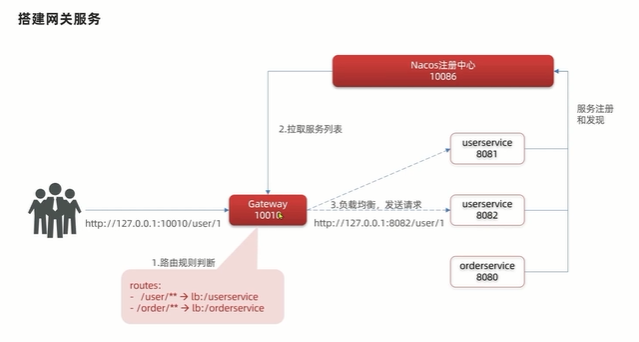
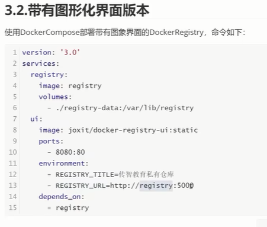
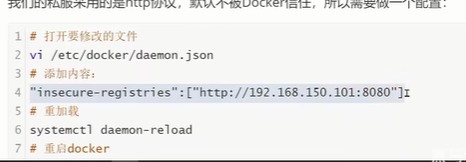
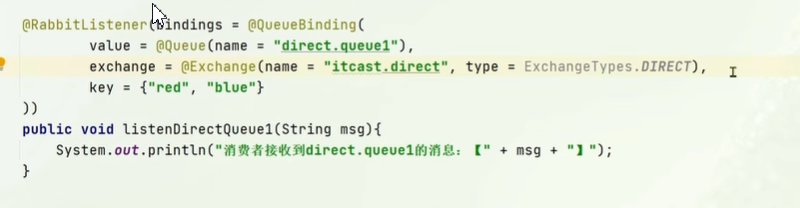
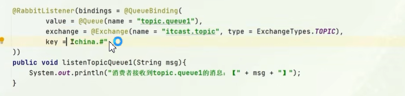

# 微服务

## 基础概念

### 有状态和无状态

- **有状态** 就是有数据存储功能，如数据库。**有状态对象(Stateful Bean)**，就是有实例变量的对象，可以保存数据，是非线程安全的。在不同方法调用间不保留任何状态。
- **无状态** 就是一次操作，不能保存数据，如系统应用。**无状态对象(Stateless Bean)**，就是没有实例变量的对象.不能保存数据，是不变类，是线程安全的。

