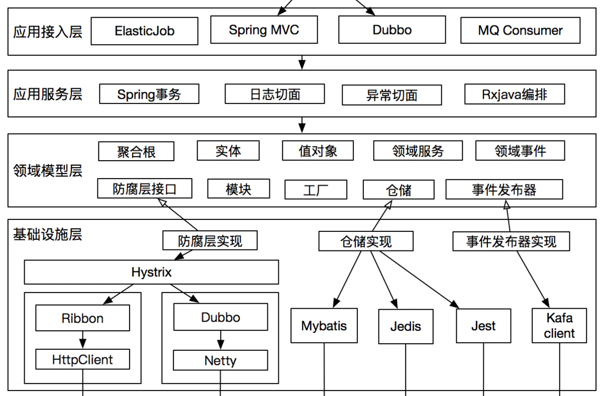
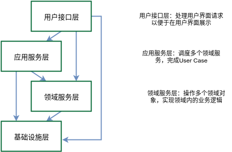

# DDD
## 前言
核心：面向接口编程
重点：区分实体和值对象
原则：对当前业务有效，不要过多考虑未来业务
DDD中的业务：引起实体状态变化的操作
思想：隔离外部依赖的第三方接口

## 对象分类
实体 -- Entity
定义：有自己行为 生命周期的对象，与业务操作强相关
值对象 -- VO DTO
业务数据传输，适配入参和出参
数据库对象 -- DO
用于数据库表字段映射
## 整体架构

