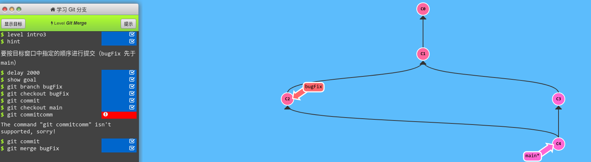
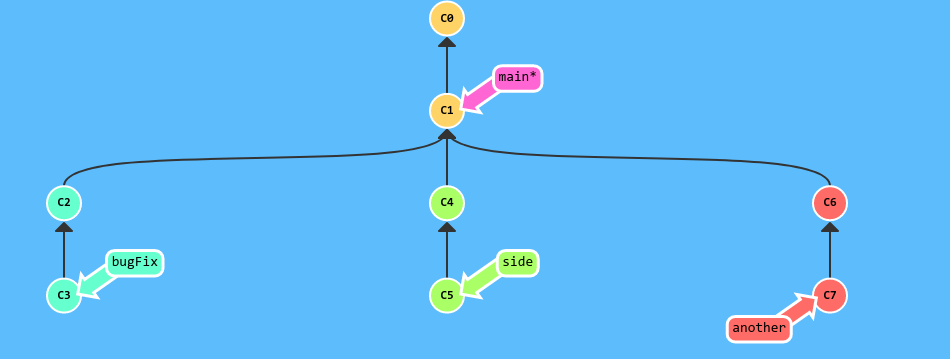
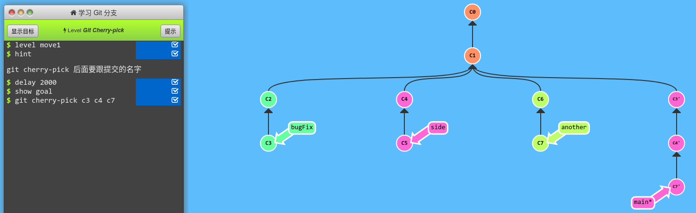
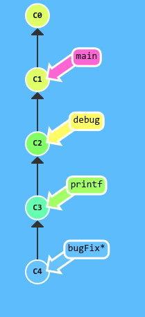
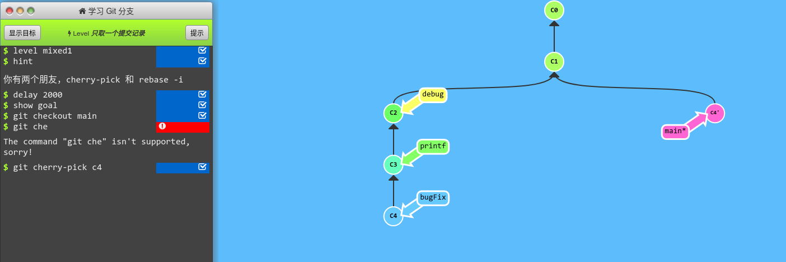

# Git
## 分支
git branch branchName    创建分支
git branch -b branchName        创建并切换到分支
git branch -d branchName        删除分支
git checkout branchName         切换分支

## 撤销监管
git checkout filename     直接覆盖工作区的文件
git rm --cached   filename    删除暂存区文件并不追踪该文件
git reset filename     撤销上一次的add 
也可替换成 git restore --staged fileName
更加常用的方法    git reset HEAD .

## 暂存修改的内容
git stash    存储工作区修改的内容
git stash pop    恢复最近一次贮存的修改
git stash list      展示暂存内容列表
git stash clear    删除stash的内容
git stash drop stash@{index} 删除指定位置的stash内容

reset 本质是在工作区的操作，不涉及远程仓库
git cherry-pick  c1 c2     挑选几次提交追加到当前分支
git rebase --continue
误删文件的恢复
git checkout -- test.txt

## 若要撤回提交的代码 !!!
git reset HEAD^ -- 	AIExplorer/ai-explorer/be/src/main/java/com/zte/ums/publisher/zadoop/common/OperatorTreeParser.java
git commit --amend
git push origin HEAD:refs/for/AI-Explorer-dev

## git rebase
[rebase操作](http://jartto.wang/2018/12/11/git-rebase/)
git rebase -i
*main
git merge dev   一般用于两条分支 将一个分支的代码合并到主分支上，整个分支的形状是分分合合。

*dev
git rebase main   将多次提交的记录捋成一条直线。

先用 git rebase -i 将提交重新排序，然后把我们想要修改的提交记录挪到最前
然后用 git commit --amend 来进行一些小修改
接着再用 git rebase -i 来将他们调回原来的顺序
最后我们把 main 移到修改的最前端（用你自己喜欢的方法），就大功告成啦！
