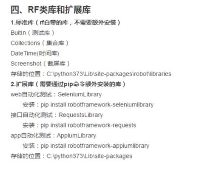

# Robotframework 安装

1. pip install --user robotframework==3.1
    
2. pip install --user robotframework-ride
    

注：--user 解决权限问题  

# 常用类库

# Robot文件详解

  

\[Documentation\]文档说明

\[Tags\]用于指定 测试用例的标签.

\[Setup\], \[Teardown\]用于指定 Setup和Teardown.

\[Template\]用于指定 测试模板. 测试用例本身将只包含数据, 每行数据都是传递给该关键字的参数, 最终实现数据驱动的测试.

\[Timeout\]用于设置 test case timeout. timeouts .

Force Tags, Default Tags测试用例的标签 的强制(forced)值和默认值.

Force Tags 在Setting表中设置

包含该设置的测试用例文件中所有用例都被指定打上这些标签. 如果这是用在 test suite initialization file, 则下面的所有子测试套件都被打上这些标签.

Default Tags 在Setting表中设置

没有单独设置 \[Tags\] 的用例将被打上这些默认标签. 默认标签不支持在测试套件的初始化文件中指定.

标签的目的

1. 标签在 reports, logs 以及测试数据中展示, 显示关于测试用例的元数据信息.
    
2. 用例的 执行统计 (total, passed, failed 就是自动基于标签收集的).
    
3. 使用标签, 可以 包含或排除 测试用例来执行.
    
4. 使用标签, 可以指定何种用例是 critical.
    

# 语法

## 变量类型

### 变量  

${UserNameHRM}  Admin   #Scalar  
${PasswordHRM}  admin123    #Scalar  
@{CredentialsTheInternetHerokuApp}  tomsmith  SuperSecretPassword!  #List  
&{VisibleElements}  OrangeHRM=id:welcome  InternetHerokuApp=css:\[href="/logout"\]  #Dictionary

数字一般需要 ${num} 否则会成为字符串类型

@{}列表类型和${}列表类型都可以表示list类型，均可以通过 set variable 和 create list 创建，区别主要是展示格式和引用格式；

  

如：

@{}类型可以通过 set variable 和 create list 将其转换成${}类型；

${}类型只能通过 set variable 将其转换成@{}；

${}类型通过 create list 将会生成一个只有一个元素的嵌套列表，该唯一的元素值为${}类型本身；

### 创建变量

Create List

Create Dictionary

${var1}    ${var2} =    Set Variable    Hello    world    

### 常量

#### 操作系统相关

${CURDIR}    文件夹的绝对路径  

${/}    系统路径分隔符

${\\n}    换行符

  

#### 布尔和None Null

${true}

${false}

${None}

${null}

${SPACE}    空格

${EMPTY}    &{EMPTY}    @{EMPTY}

  

  

  

## 数据转换

Convert To Hex

|   |   |   |   |   |   |
| --- | --- | --- | --- | --- | --- |
| ${result} = | Convert To Hex | 255 |    |    | \# Result is FF |
| ${result} = | Convert To Hex | -10 | prefix=0x | length=2 | \# Result is -0x0A |
| ${result} = | Convert To Hex | 255 | prefix=X | lowercase=yes | \# Result is Xff |

Convert To Integer

|   |   |   |   |   |
| --- | --- | --- | --- | --- |
| ${result} = | Convert To Integer | 100 |    | \# Result is 100 |
| ${result} = | Convert To Integer | FF AA | 16 | \# Result is 65450 |
| ${result} = | Convert To Integer | 100 | 8 | \# Result is 64 |
| ${result} = | Convert To Integer | -100 | 2 | \# Result is -4 |
| ${result} = | Convert To Integer | 0b100 |    | \# Result is 4 |
| ${result} = | Convert To Integer | -0x100 |    | \# Result is -256 |

Convert To Number  

|   |   |   |   |   |
| --- | --- | --- | --- | --- |
| ${result} = | Convert To Number | 42.512 |    | \# Result is 42.512 |
| ${result} = | Convert To Number | 42.512 | 1 | \# Result is 42.5 |
| ${result} = | Convert To Number | 42.512 | 0 | \# Result is 43.0 |
| ${result} = | Convert To Number | 42.512 | -1 | \# Result is 40.0 |

Convert To Octal

|   |   |   |   |   |   |
| --- | --- | --- | --- | --- | --- |
| ${result} = | Convert To Octal | 10 |    |    | \# Result is 12 |
| ${result} = | Convert To Octal | -F | base=16 | prefix=0 | \# Result is -017 |
| ${result} = | Convert To Octal | 16 | prefix=oct | length=4 | \# Result is oct0020 |

Convert To String

## 流程控制语句

### FOR 循环

FOR    ${i}    IN RANGE    len(${rsp.json()\['result'\]\['data'\]})  
    log    len(${rsp.json()\['result'\]\['data'\]})  
    Append To List    ${taskNamelist}    ${rsp.json()\['result'\]\['data'\]}\[${i}\]\[taskName\]  
END  
  
FOR    ${i}    IN RANGE    len(${datalist})  
    ${taskName}=    set Variable    ${datalist\[${i}\]\['taskName'\]}  
    ${trainTaskId}=    set Variable    ${datalist\[${i}\]\['taskId'\]}  
    Run Keyword If    "${taskName}"=="${querytaskName}"    Exit for loop    //   可以被替换成 IF 条件 BREAK CONTINUE  
END  

###   
IF语句

IF    '${item}' == '${element}'    RETURN    ${index}  
等同于  
Return From Keyword If    '${item}' == '${element}'    ${index}  

### 三目运算符

${var2} =    Set Variable If    ${rc} > 0    value1    value2   

 ${var1} =    Set Variable If    ${rc} == 0    zero    nonzero    

${var3} =    Set Variable If    ${rc} > 0    whatever

### 断言

Should Be Empty    

Should Be Equal 

    Should Be Equal    ${status}    started  

    Should Be Equal As Strings    ${rsp.json()\['status'\]}    0

Should Be Equal  AS Strings  // Integers 

Should End With

Should Contain

Should Start With

Should Be True

  

上述均可逆 也就是 Should Not ...

## 额外操作

Test Setup   测试用例之前执行

Test Teardown  类似于finally

evaluate        执行 python中的语句 -----神器

## 包导入

Import Library    库  

Import Resource 静态资源

Import Variables 导入文件作为参数

# SeleniumLibrary 库 -- 待学习

Open Browser

Close Browser
