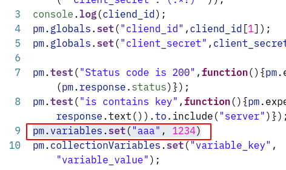

# 变量和参数
## 内置参数
{{$timestamp}} 生成当前时间的时间戳
{{$randomInt}} 生成0-1000之间的随机数
{{$guid}} 生成速记GUID字符串
### 环境变量 
新建环境    设置环境变量  
### 局部变量
pm.variables.set("variable\_key", "variable\_value");仅在当前request中有效
pm.collectionVariables.set("variable\_key", "variable\_value");    在当前Collection中有效

# 断言
## body相关

pm.response.to.have.status(code:Number)

pm.response.to.have.status(reason:String)

pm.response.to.have.header(key:String)

pm.response.to.have.header(key:String, optionalValue:String)

pm.response.to.have.body()

pm.response.to.have.body(optionalValue:String)

pm.response.to.have.body(optionalValue:RegExp)

pm.response.to.have.jsonBody()

pm.response.to.have.jsonBody(optionalExpectEqual:Object)

pm.response.to.have.jsonBody(optionalExpectPath:String)

pm.response.to.have.jsonBody(optionalExpectPath:String,

optionalValue:*)

## 响应码相关

通过pm.response.to.be对象属性，可以断言预定义的规则。

① pm.response.to.be.info，检查响应码是否为1××，如果是

则断言为真，否则为假。

② pm.response.to.be.success，检查响应码是否为2××，如果

是则断言为真，否则为假。

③ pm.response.to.be.redirection，检查响应码是否为3××，

如果是则断言为真，否则为假。

④ pm.response.to.be.clientError，检查响应码是否为4××，

如果是则断言为真，否则为假。

⑤ pm.response.to.be.serverError，检查响应码是否为5××，

如果是则断言为真，否则为假。

⑥ pm.response.to.be.error，检查响应码是否为4××或者

5××，如果是则断言为真，否则为假。

⑦ pm.response.to.be.ok，检查响应码是否为200，如果是则断

言为真，否则为假。

⑧ pm.response.to.be.accepted，检查响应码是否为202，如果

是则断言为真，否则为假。

⑨ pm.response.to.be.badRequest，检查响应码是否为400，如

果是则断言为真，否则为假。

⑩ pm.response.to.be.unauthorized，检查响应码是否为401，

如果是则断言为真，否则为假。

⑪ pm.response.to.be.forbidden，检查响应码是否为403，如果

是则断言为真，否则为假。

⑫ pm.response.to.be.notFound，检查响应码是否为404，如果

是则断言为真，否则为假。

⑬ pm.response.to.be.rateLimited，检查响应码是否为429，如

果是则断言为真，否则为假。

## 实例

类似于 单元测试中的 Assert

分为状态断言 和 业务断言

var cliend\_id = responseBody.match(new RegExp('"client\_id":"(.*?)"'));  
var client\_secret = responseBody.match(new RegExp('"client\_secret":"(.*?)"'));  
console.log(cliend_id);  
pm.globals.set("cliend\_id",cliend\_id\[1\]);  
pm.globals.set("cliend\_id",client\_secret\[1\])  
// 状态断言  
pm.test("Status code is 200",function(){pm.expect(pm.response.status)});  
// 业务断言  
pm.test("is contains key",function(){pm.expect(pm.response.text()).to.include("server")});  

# 脚本编写

优点：动态向集合中添加动态行为

## 预置脚本编写

是指在请求发送之前执行的脚本。如果想在请求发送时包含当前时间戳或者一个随机的字母、数字、字符串，在这个场景下使用预请求脚本是很好的。

## 脚本编写语句

|                                             |                                 |                                                                                                                                                                                                                                                   |
| ---------------------------------------------- | ---------------------------------- | ---------------------------------------------------------------------------------------------------------------------------------------------------------------------------------------------------------------------------------------------------- |
| clear a global variable                        | 清除全局变量                        | pm.globals.unset("variable_key");                                                                                                                                                                                                                     |
| Clear an environment variable                   | 清除一个环境变量                    | pm.environment.unset("variable_key");                                                                                                                                                                                                                 |
| get a global variable                          | 得到一个全局变量                    | pm.globals.get("variable_key");                                                                                                                                                                                                                       |
| get a variable                                 | 得到一个变量                        | pm.variables.get("variable_key");                                                                                                                                                                                                                     |
| Get an environment variable                     | 得到一个环境变量                    | pm.environment.get("variable_key");                                                                                                                                                                                                                   |
| response body:contains string                   | 检查response body包含字符串         | pm.test("Body matches string", function () { pm.expect(pm.response.text()).to.include("string\_you\_want\_to\_search"); });                                                                                                                             |
| response body:convert XML body to a JSON object | response body：将XML转换为JSON对象   | var jsonObject = xml2Json(responseBody);                                                                                                                                                                                                               |
| response body:is equal to a string              | 检查响应体等于一个字符串             | pm.test("Body is correct", function () { pm.response.to.have.body("response\_body\_string"); });                                                                                                                                                        |
| response body:JSON value check                  | 检查response body中JSON某字段值      | pm.test("Your test name", function () { var jsonData = pm.response.json(); pm.expect(jsonData.value).to.eql(100); });                                                                                                                                   |
| response headers:content-Type header check      | 检查content-Type是否包含在header返回 | pm.test("Content-Type is present", function () { pm.response.to.have.header("Content-Type"); });                                                                                                                                                        |
| response time is than 200ms                     | 响应时间超过200ms                   | pm.test("Response time is less than 200ms", function () { pm.expect(pm.response.responseTime).to.be.below(200); });                                                                                                                                     |
| send s request                                 | 发送一个请求                        | pm.sendRequest("[https://postman-echo.com/get](https://postman-echo.com/get)", function (err, response) { console.log(resp onse.json()); });                                                                                                            |
| set a global variable                          | 设置一个全局变量                    | pm.globals.set("variable\_key", "variable\_value");                                                                                                                                                                                                   |
| set an environment variable                     | 设置一个环境变量                    | pm.environment.set("variable\_key", "variable\_value");                                                                                                                                                                                                |
| status code:Code is 200                        | 状态码：代码是200                   | pm.test("Status code is 200", function () { pm.response.to.have.status(200); });                                                                                                                                                                       |
| status code:code name has string                | 状态码：代码中有指定字符串           | pm.test("Status code name has string", function () { pm.response.to.have.status("Created"); });                                                                                                                                                        |
| status code：successful POST request            | 状态码：成功的post请求               | pm.test("Successful POST request", function () { pm.expect(pm.response.code).to.be.oneOf(\[201,202\]); });                                                                                                                                              |
| use tiny validator for JSON data                | 为json数据使用tiny验证器             | var schema = { "items": { "type": "boolean" } }; var data1 = \[true, false\]; var data2 = \[true, 123\]; pm.test('Schema is valid', function() { pm.expect(tv4.validate(data1, schema)).to.be.true; pm.expect(tv4.validate(data2, schema)).to.be.true; }); |
