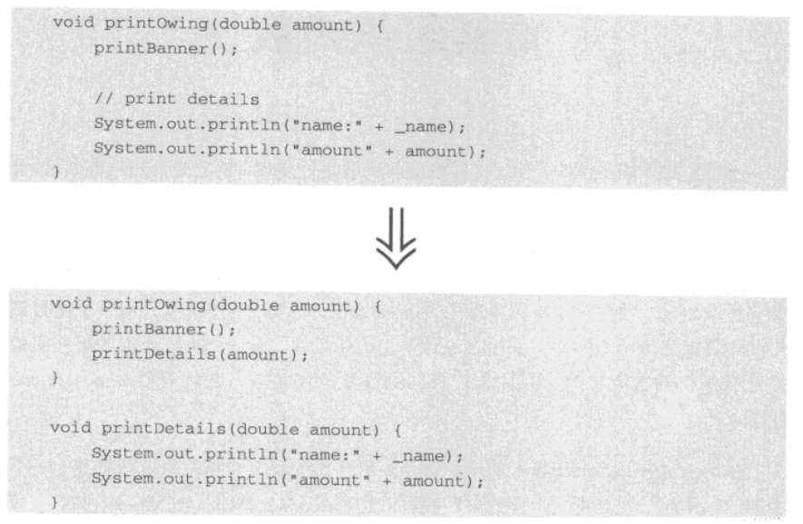
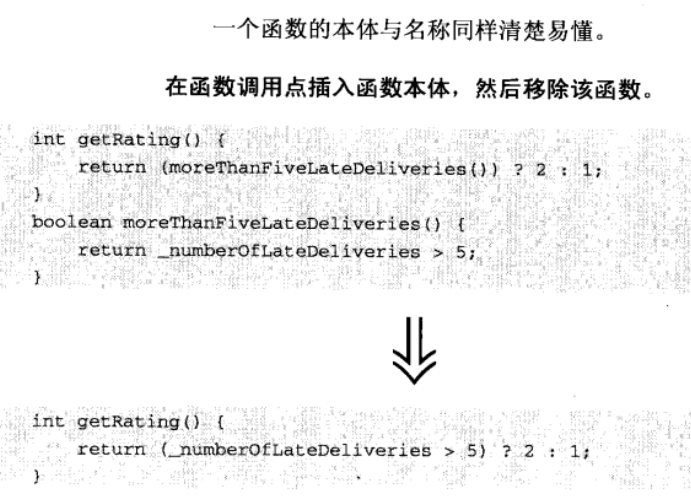
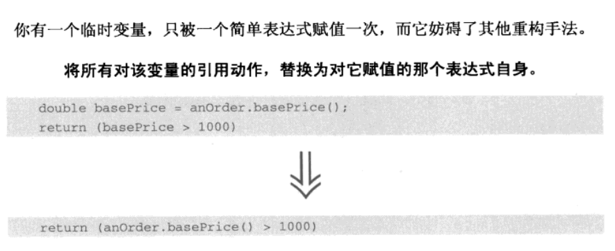
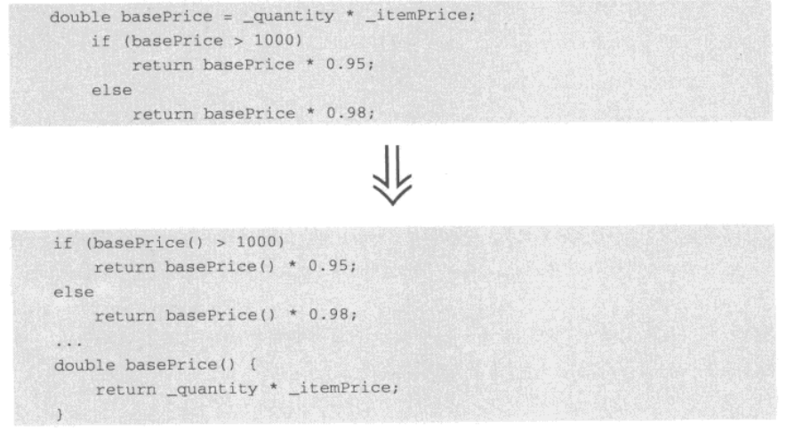
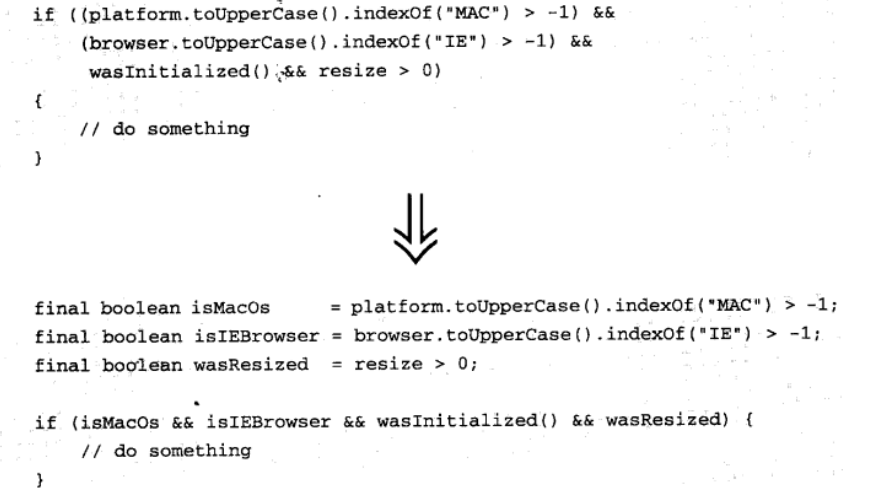
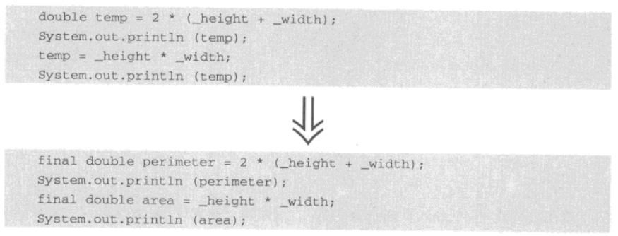
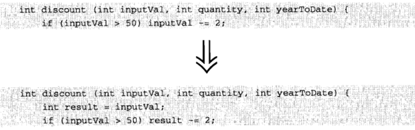
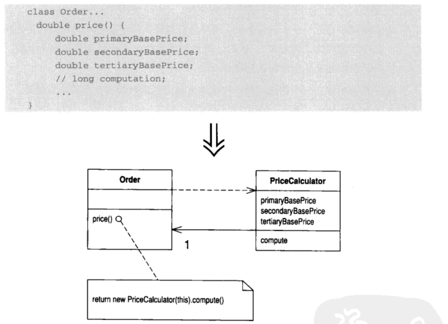
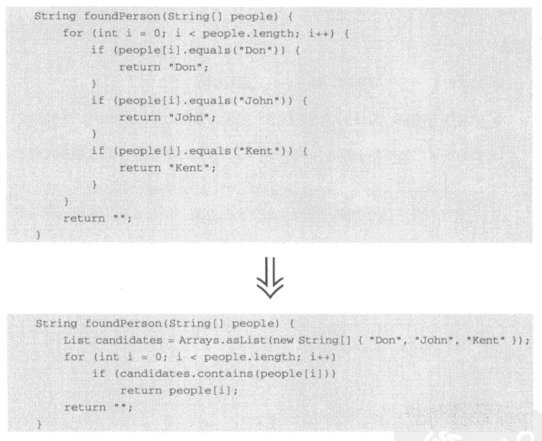

# 重构
## 重构列表
### 结论：
这一章节主要介绍了重构方法的组成，也是后续6-12章重构方法展开解释的脉络。
### 重构记录的格式
1. 名称            重构的方法名
2. 简短概要     做了什么事 解决了什么问题 重构前后的示例（代码或UML）
3. 动机            为什么要重构
4. 做法            怎么重构的
5. 范例            例子说明
### 寻找引用点
1. 不要盲目替换。检查每一个引用点，确定它指向想要替换得东西。
2. 使用编译器帮助寻找引用点。
**使用编译器查找，要注意的问题：**
被删除的部分在继承体系中声明不止一次，编译器也会迷惑。？？？
编译器速度慢
编译器无法通过反射机制得到的引用点。使用反射，必须为编译搭配测试。
### 介绍重构方法之前
1. 重构的基本技巧——小步前进、频繁测试
2. 本书中重构手法的前提：“单进程软件”，并不适合并发和分布式程序设计。
3. 重构与设计模式紧密联系：模式是希望到达的目标，重构则是达到之路

## 重新组织函数
### 结论
为什么要对函数进行重构，函数用于包装代码，对其重构是为了更恰当地包装代码，工作的更好
|          场景          |                方法                |    不足     |
| :-------------------: | :-------------------------------: | :---------: |
|       过长的函数       |                Extract Method                 | 处理局部变量 |
| 某些函数没有做实质性的事 |              InLine Method              |             |
|      替换临时变量       |      Split Temporary Variable + Replace Temp With Query       |             |
|  临时变量混乱 难以替换   | Replace  Method With Method Object |   引入类    |
|    函数内部参数赋值     |  Remove Assignments to Parameters  |             |
|        算法改进        |        Substitute Algorithm        |             |
|表达式过于复杂 | Introduce Explaining Variable|    |
### 1. Extract Method （提炼函数）
1. 简明概要
你有一段代码可以被组织在一起并独立出来。
将这段代码放到一个独立的函数中， 并让函数名称解释该函数的用途。

2. 动机
过长函数或者需要注释才能让人理解的代码
简短而命名良好的函数，有以下优点：
    函数粒度小，复用机会变大。
    使得高层函数读起来像一系列注释 。
    覆写容易。
3. 做法
函数名以"做什么"，而不是"怎么做"命名。
处理局部变量
    可用查询消除部分局部变量
    可将局部变量当作参数传给目标函数
    可返回局部变量
    如需返回多个，则继续提炼，知道只需返回一个
4. 范例

### 2. Inline Method （内联函数）
1. 简明概要
一个函数的本体与名称同样清楚易懂。
在函数调用点插入函数本体，然后移除函数

2. 动机
函数内容与名称同样清晰
对于提取函数过度的情况，可将不合理的函数内联到一个大型函数中，然后可适当重新提取函数
3. 做法
1. **检查函数，确定它不具有多态性**
2. **如果内联的函数过于复杂，就不要动 **
3. 将这个函数的所有调用点都替换成函数本体
4. 编译测试
5. 删除该函数的定义
### 3. Inline Temp （内联临时变量）
1. 简明概要
一个临时变量，只被一个简单表达式赋值一次，而它妨碍了其他重构手法。
将所有对该变量的引用动作，替换为对它赋值的那个表达式自身

2. 动机
你发现某个临时变量被赋予某个函数调用的返回值。
3. 做法
1. 确保赋值表达式没有副作用
2. 将变量声明为 final，检查该临时变量是否真的只被赋值一次
3. 如果对临时变量赋值的表达式计算量较大，可适当不进行此手法
4. 每次修改后编译并测试
5. 修改完所有引用点后，删除该临时变量的声明和赋值语句
6. 编译测试
### 4. Replace Temp with Query （以查询取代临时变量）
1. 简明概要
你的程序以一个临时变量来保存一个表达式的运算结果。
将整个表达式提炼到一个独立的函数中。将这个变量的引用点替换为对这个新函数的调用。此后，新函数可被其它函数调用。

2. 动机
临时变量是函数内有效的，会让你写更长的函数，将临时变量替换成查询，同类的其他函数均可共享这查询，使得类组织更加清晰
3. 做法
找出只被赋值一次的临时变量。如被赋值多次，分割为多个变量
将变量声明为 final，检查该临时变量是否真的只被赋值一次
将复制语句提炼到独立函数
### 5. Introduce Explaining Variable （引入解释性变量）
你有一个复杂的表达式。
将该复杂表达式（或其中一部分）的结果放进一个临时变量，以次变量名称来解释表达式的用途。

动机
解释运算代码的意义
此手法便于理解代码, 但是引入过多临时变量, 不利于后序Extract Method的使用
运用此手法之前可优先尝试Extract Method手法, 相比之下引入解释性变量局限性较大, 当局部变量过多难以进行Extract Method时, 可使用此手法.
做法
声明一个final临时变量，将待分解之复杂表达式中的一部分动作的运算结果复制给它。
替换运算结果

何时用： Extract Method 代价大不易实现，原则是尽量使用Extract Method
### 6. Split Temporary Variable （分解临时变量）
某个临时变量被赋值超过一次，它既不是循环变量，也不被用于收集计算结果。
针对每次赋值, 创造一个独立、对应的临时变量。

动机
解决变量被多次赋值，意义不明确的问题
一个临时变量承担两件事情时，就会影响阅读
做法
在第二次赋值处，重新声明临时变量
### 7. Remove Assignments to Parameters （移除对参数的赋值）
代码对一个参数进行赋值。
以一个临时变量来取代改参数的位置，不要对参数赋值

动机
对参数赋值降低函数清晰度，混用了按值传递和按引用传递这个两种方式。
在按值传递的情况下，对参数的任何修改，都不会对调用端造成影响。
做法
如果代码的语义是按引用传递，请在调用端检查调用后是否还使用了这个参数，也要检查有多少个按引用传递的参数被赋值后又被调用。请尽量只以return方式返回一个值。如果需要返回的值不止一个，看看可否封装为一个对象，或者为每个返回值设计对应的一个独立函数。
如有必要，请用final修饰参数，让编译期检查函数中是否有对参数赋值的情况，适用于长函数的情况，防止变量被修改
### 8. Replace Method with Method Object （以函数对象取代函数）
你有一个大型函数, 其中对局部变量的使用使你无法采用Extract Method。
将这个函数放进一个单独对象中，如此一来局部变量就成了对象内的字段。然后你可以在同一个对象中将这个大型函数分解为多个小型函数。

动机
局部变量的存在会增加函数分解难度。如果查询代替局部变量不好使，就使用函数对象。
做法
建立一个新类，根据待处理函数的用途，为这个类命名
在新类中建立一个final字段，用以保存原先大型函数所在的对象（源对象）。同时，针对原函数的每个临时变量和每个参数，在新类中建立一个对应的字段保存之
在新类中建立一个构造函数，接收源对象及原函数的所有参数作为参数
在新类中建立一个compute()函数.
将原函数的代码复制到compute()函数中。如果需要调用源对象的任何函数，请通过源对象字段调用
编译.
将旧函数的函数本体替换为这样一条语句：“创建上述新类的一个新对象，而后调用其中的compute()函数”
由于所有局部变量都变成了字段，可以任意分解这个大型函数，不用传递任何参数。

### 9. Substitute Algorithm （替换算法）
要把某个算法替换为另一个更清晰的算法。
将函数本体替换为另一个算法。

动机
在替换之前先保证自己是否充分了解被替换的算法，若算法过大，先行拆解，增加清晰度。
做法
编译新替换的算法
替换后要测试
### 总结
当面对一个比较长 大的函数时，优先做的是抽取（Extract Method）也就是拆分，使得函数调用看起来像注释。
在拆分过程中会遇到一些问题如 临时变量过多 繁杂，此时有几种应对策略
1. **查询取代临时变量**
2. 以函数对象取代函数 难以抽取时，变成**函数对象**
3. **内联临时变量** 表达式-> 临时变量 或者 直接返回结果
4. 需要注意的点：**分解临时变量**。一个变量不能承担多个角色
若大函数中逻辑运算复杂且不易抽取成函数直接使用，可以用 **解释性变量** 辅助阅读
如果函数本身所做的事情逻辑比较简单，且仅在某个函数中调用，就可以把这个函数释放，直接使用主体
又 如果有比当前函数更加清晰或高效的算法可以替换使用