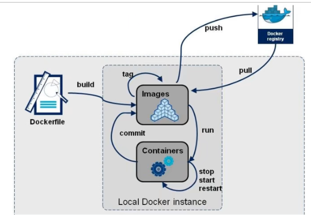
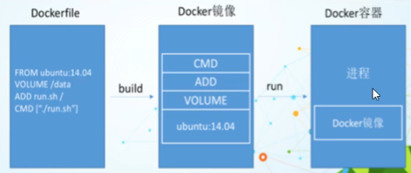

# **Docker学习**
## 基本概念

容器和镜像

容器 container 可以独立运行的一个或一组应用，镜像创建的运行实例 容器内包含程序以及运行环境





## Docker速查表

```shell
docker  version 															# 查看docker版本
docker info 																	# 查看docker相关信息
systemctl stop docker 												# 停止docker
systemctl start docker												# 开启docker
systemctl restart docker 										 # 重启docker
service docker status  													# 查看docker运行状态

docker pull hello world												# 拉取镜像
docker rmi image_id 												# 删除镜像
docker run -it image_name /bin/bash																			# 交互式运行一个容器 关闭终端则容器停止
docker run -it  -v 宿主机目录:容器目录 --name your_name  image_name    # 挂载目录 实现文件互通
docker stop container_name																							 # 停止容器
docker start 																															  # 开启容器
docker exec -it container_name /bin/bash 															    # 进入容器
docker run --gpus all image_name 
```


## **Docker配置**

### 下载 安装 卸载

```shell
apt-cache madison docker-ce # 查看可用的docker版本
下载docker 注册key
curl -s -L https://nvidia.github.io/nvidia-docker/gpgkey | \ sudo apt-key add -

下载nvidia-docker 注册key
 curl -s -L https://nvidia.github.io/nvidia-docker/$distribution/nvidia-docker.list | \
 sudo tee/etc/apt/sources.list.d/nvidia-docker.list
 
apt-get install docker-ce=5:20.10.2~3-0~ubuntu-bionic  #安装指定版本的docker
apt-get remove docker-ce docker-ce-cli # 删除docker
```

### PS:可能会遇到的问题

#### 网络不通 解决办法

```shell
在 https://www.ip138.com/ 找到网址对应的ip地址
写入到 hosts文件中,相同的办法也适用于 github的访问
vi /etc/hosts
#nvidia-docker
185.199.108.153 nvidia.github.io
185.199.109.153 nvidia.github.io
185.199.110.153 nvidia.github.io
185.199.111.153 nvidia.github.io
```

#### 用户权限问题

```shell
ls -l /var/run/docker.sock					# 查看docker 用户
groupadd docker 								#添加用户组
gpasswd -a ${USER} docker 			 # 将当前用户加入到docker组中
newgrp docker									  # 更新用户组
cat /etc/group										# 查看用户组
```

### 配置docker

​	镜像源加速
​	改变docker镜像的默认安装位置
​	设置nvidia-docker的运行时环境

```shell
gedit /etc/docker/daemon.json
写入
{
    "runtimes": {
        "nvidia": {
            "path": "nvidia-container-runtime",
            "runtimeArgs": []
        }
    },
    "registry-mirrors": ["https://m0wdw8en.mirror.aliyuncs.com"], 
    "graph": "/usr/local/dockerdata"
}
```


## **Docker相关操作**

### docker 服务

```shell
docker  version 					# 查看docker版本
docker info 							# 查看docker相关信息
systemctl stop docker 		# 停止docker
systemctl start docker		# 开启docker
systemctl restart docker  # 重启docker
```

### 镜像

```shell
docker pull hello world					# 拉取镜像
docker rmi image_id 					# 删除镜像
```

### 容器

```shel
docker run -it image_name /bin/bash																			# 交互式运行一个容器 关闭终端则容器停止
docker run -it  -v 宿主机目录:容器目录 --name your_name  image_name    # 挂载目录 实现文件互通
docker stop container_name																							 # 停止容器
docker start 																															  # 开启容器
docker exec -it container_name /bin/bash 															    # 进入容器
```

#### PS:如果想要使用GPU,那么需要如下操作

```shell
docker run --gpus all image_name 
```

#### docker run参数详解

```shell
-d, --detach=false， 指定容器运行于前台还是后台，默认为false
-i, --interactive=false， 打开STDIN，用于控制台交互
-t, --tty=false， 分配tty设备，该可以支持终端登录，默认为false
-u, --user=""， 指定容器的用户
-a, --attach=[]， 登录容器（必须是以docker run -d启动的容器）
-w, --workdir=""， 指定容器的工作目录
-c, --cpu-shares=0， 设置容器CPU权重，在CPU共享场景使用
-e, --env=[]， 指定环境变量，容器中可以使用该环境变量
-m, --memory=""， 指定容器的内存上限
-P, --publish-all=false， 指定容器暴露的端口
-p, --publish=[]， 指定容器暴露的端口
-h, --hostname=""， 指定容器的主机名
-v, --volume=[]， 给容器挂载存储卷，挂载到容器的某个目录
--volumes-from=[]， 给容器挂载其他容器上的卷，挂载到容器的某个目录
--cap-add=[]， 添加权限，权限清单详见：http://linux.die.net/man/7/capabilities
--cap-drop=[]， 删除权限，权限清单详见：http://linux.die.net/man/7/capabilities
--cidfile=""， 运行容器后，在指定文件中写入容器PID值，一种典型的监控系统用法
--cpuset=""， 设置容器可以使用哪些CPU，此参数可以用来容器独占CPU
--device=[]， 添加主机设备给容器，相当于设备直通
--dns=[]， 指定容器的dns服务器
--dns-search=[]， 指定容器的dns搜索域名，写入到容器的/etc/resolv.conf文件
--entrypoint=""， 覆盖image的入口点
--env-file=[]， 指定环境变量文件，文件格式为每行一个环境变量
--expose=[]， 指定容器暴露的端口，即修改镜像的暴露端口
--link=[]， 指定容器间的关联，使用其他容器的IP、env等信息
--lxc-conf=[]， 指定容器的配置文件，只有在指定--exec-driver=lxc时使用
--name=""， 指定容器名字，后续可以通过名字进行容器管理，links特性需要使用名字
--net="bridge"， 容器网络设置:
bridge 使用docker daemon指定的网桥
host //容器使用主机的网络
container:NAME_or_ID >//使用其他容器的网路，共享IP和PORT等网络资源
none 容器使用自己的网络（类似--net=bridge），但是不进行配置
--privileged=false， 指定容器是否为特权容器，特权容器拥有所有的capabilities
--restart="no"， 指定容器停止后的重启策略:
no：容器退出时不重启
on-failure：容器故障退出（返回值非零）时重启
always：容器退出时总是重启
--rm=false， 指定容器停止后自动删除容器(不支持以docker run -d启动的容器)
--sig-proxy=true， 设置由代理接受并处理信号，但是SIGCHLD、SIGSTOP和SIGKILL不能被代理
```


## **Dockerfile**

### dockerfile使用步骤 

1. ##### 创建dockerfile

```shell
FROM centos
MAINTAINER lxy<3289930671@qq.com>
ENV MYPATH /usr/local
WORKDIR $MYPATH

RUN apt-get install update
RUN apt-get install vim
RUN apt-get install net-tools

EXPOSE 80

CMD echo $MYPATH
CMD echo "----end-----"
CMD /bin/bash
```

2. 命令讲解

   ```shell
   FROM 			基础镜像 一切从这里开始
   MAINTAINER 	镜像是谁写的 姓名 + 邮箱
   RUN		镜像运行时的命令
   ADD		添加内容 比如要安装的tomcat包
   WORKDIR		创建容器后首先进入的工作目录
   VOLUME		挂载的目录
   EXPOSE		 端口配置
   CMD 			指定这个容器时运行的命令,只有最后一个会生效
   类似于 RUN 指令，用于运行程序，但二者运行的时间点不同:
   CMD 在docker run 时运行。
   RUN 是在 docker build。
   作用：为启动的容器指定默认要运行的程序，程序运行结束，容器也就结束。CMD 指令指定的程序可被 docker run 命令行参数中指定要运行的程序所覆盖。
   注意：如果 Dockerfile 中如果存在多个 CMD 指令，仅最后一个生效。
   格式：
   
   CMD <shell 命令> 
   CMD ["<可执行文件或命令>","<param1>","<param2>",...] 
   CMD ["<param1>","<param2>",...]  # 该写法是为 ENTRYPOINT 指令指定的程序提供默认参数
   推荐使用第二种格式，执行过程比较明确。第一种格式实际上在运行的过程中也会自动转换成第二种格式运行，并且默认可执行文件是 sh。
   
   ENTRYPOINT  追加命令
   类似于 CMD 指令，但其不会被 docker run 的命令行参数指定的指令所覆盖，而且这些命令行参数会被当作参数送给 ENTRYPOINT 指令指定的程序。
   但是, 如果运行 docker run 时使用了 --entrypoint 选项，将覆盖 ENTRYPOINT 指令指定的程序。
   优点：在执行 docker run 的时候可以指定 ENTRYPOINT 运行所需的参数。
   注意：如果 Dockerfile 中如果存在多个 ENTRYPOINT 指令，仅最后一个生效。
   格式：
   ENTRYPOINT ["<executeable>","<param1>","<param2>",...]
   
   ONBUILD 
   COPY 			类似ADD 文件
   复制指令，从上下文目录中复制文件或者目录到容器里指定路径。
   COPY [--chown=<user>:<group>] <源路径1>...  <目标路径>
   COPY [--chown=<user>:<group>] ["<源路径1>",...  "<目标路径>"]
   

   ENV				设置环境变量
   
   ENTRYPOINT 和 CMD 的区别
   CMD ['ls','-a']
   RUN <命令行命令>
   # <命令行命令> 等同于，在终端操作的 shell 命令。
   RUN ["可执行文件", "参数1", "参数2"]
   # 例如：
   # RUN ["./test.php", "dev", "offline"] 等价于 RUN ./test.php dev offline
   ```
3. ##### 构建镜像

   ```shell
   docker build -f mydockerfile -t mycentos:0.1 
   ```

4. 运行镜像

   ```shell
   docker run container_id -l  如果 是cmd 会报错,entrypoint不会报错.
   ```
5. ###### 查看镜像变更历史

   ```shell
   docker history  image_name
   ```

6. 发布镜像

   ```shell
   docker tag image_id  author/image:version # 自己发布时需要加上版本号
   docker  login -u username -p password
   docker push lxy/mydocker:version(1.0)
   ```


7. Tomcat实例

   ```shell
   FROM
   MAINTIANER 
   COPY
   ADD
   ADD
   RUN
   ENV
   WORKDIR
   ENV JAVA_HOME
   ENV CLASSPATH $JAVA_HOME/lib/dt.jar:$JAVA_HOME/lib/tools.jar
   ENV CATALINA_HOME
   ENV CATALINA_BASH
   ENV PATH $PATH:$JAVVA_HOME/bin:$CATALINA_HOME/lib:$CATALINA_HOME/bin
   EXPOSE 8080
   CMD /usr/local/apache/bin/startup.sh && tail -F /usr/local/apache/logs/catalina.out
   
   # 路径中的 : 号起到分割的作用
   ```

## Pycharm使用Docker搭建的环境

```shell
# 解决使用docker环境时socket不通的问题
chmod a+rwx /var/run/docker.sock		 
chmod a+rwx /var/run/docker.pid				
```

#### GPU检查是否可用

```
import torch 
torch.version.cuda 					# 检查cuda版本
torch.cuda.is_available() 	  # 检测cuda是否可用
```
