# Linux命令
## 命令速查
```shell
ls -l 
ls -a ls -la
ls -lt  带时间
ls -l 正则表达式

文件类型
d dirs 
- 普通文件
c 接口设备
s 套接字
p 管道文件
l 链接文件
b 块文件

用户
user group other
u owner
g group
o other
a all

权限
r read    4
w write   2
x execute 1
更改权限  
chmod u+rwx filename
chmod 777 filename
更改文件所有者
chown -R user/userId  dir/file
更改文件所有组
chgrp group/groupId   dir/file

查找文件
find -name /path "filename"
find -name /path ".xml" | grep 

find -user
     -group
     -uid
     -gid
     -type

file filename   查看文件类型

locate filename   定位文件
which command     定位命令位置
whereis locate  

head -n number filename 查看前n行数据
tail -n number filename 查看后n行数据
tail -f filename        实时查看文件数据
less filename           类似于向下滚动数据

cat -n                  查看文本数据带行号
    -b                  不包括空行 
      
tar -czf  fileToZip     压缩
tar -zxf  fileToUnzip   解压

mv filename newname 文件改名
mv filename path    移动文件

rm filename
rmdir dir
cp file path
  -i 交互提示
  -r 递归
  -f 强制  

mkdir -p /d1/d2/d3  创建多级目录


查看环境变量
env --所有的环境变量
$PATH -- 查看指定的环境变量

grep -i 
    


```

## Linux 路径说明
可以使用 cat 命令查看内容
/etc/hosts: 配置网站及ip地址
/etc/passwd：账户信息（目前笔者还不知道里面有具体信息，看不太懂）
/etc/shadow：账户密码，不过是加密了的
/etc/group：所有组名 
~/.bashrc   当前用户环境变量
/etc/profile  系统环境变量
/bin        二进制目录 用户GNU目录
/boot       启动目录
/etc        系统配置文件
、


## 编辑环境变量
/root/.bashrc中包括环境变量

更改后如果需要立即生效 那么需要使用 source bashrc

```shell
在 https://www.ip138.com/ 找到网址对应的ip地址
写入到 hosts文件中,相同的办法也适用于 github的访问
vi /etc/hosts
#nvidia-docker
185.199.108.153 nvidia.github.io
185.199.109.153 nvidia.github.io
185.199.110.153 nvidia.github.io
185.199.111.153 nvidia.github.io
```

## 设置桌面图标

```shell
建立**.desktop并写入
[Desktop Entry]
Name=Typora
Exec=/opt/Typora-linux-x64/Typora
Type=Application
Icon=/opt/Typora-linux-x64/resources/app/asserts/icon/icon_512x512.png
cp  **.desktop  /usr/share/applications
```
## 设置conda镜像源

```shell
conda config --show 
conda config --add channels https://mirrors.tuna.tsinghua.edu.cn/anaconda/pkgs/main/
conda config --add channels https://mirrors.tuna.tsinghua.edu.cn/anaconda/pkgs/free/
conda config --set show_channel_urls yes
conda config --remove channels " https://"
```

### pip 换源

```python
pip install -i https://pypi.tuna.tsinghua.edu.cn/simple some-package
```

## 常见Linux命令

### 关机 重启 操作

```shell
shutdown -h now 立即关机 now可以换成数字 表示几分钟后关机
sync			将内存的数据同步到磁盘
shutdown -r now 重启
reboot		重启

```

### 文件操作

#### 查看 打包 建立 删除 

```shell
ls [-alrtAFR][name...]
-a 显示所有文件及目录 (ls 内定将文件名或目录名称开头为"."的视为隐藏档，不会列出)
-l 除文件名称外，亦将文件型态、权限、拥有者、文件大小等资讯详细列出
-r 将文件以相反次序显示(原定依英文字母次序)
-t 将文件依建立时间之先后次序列出
-A 同 -a ，但不列出 "." (目前目录) 及 ".." (父目录)
-F 在列出的文件名称后加一符号；例如可执行档则加 "*", 目录则加 "/"
-R 若目录下有文件，则以下之文件亦皆依序列出

显示文件的三个命令
cat 
[root@localhost ~]# cat [选项] 文件名 显示文件
或者
[root@localhost ~]# cat 文件1 文件2 > 文件3  合并文件
-A	相当于 -vET 选项的整合，用于列出所有隐藏符号；
-E	列出每行结尾的回车符 $；
-n	对输出的所有行进行编号；
-b	同 -n 不同，此选项表示只对非空行进行编号。
-T	把 Tab 键 ^I 显示出来；
-V	列出特殊字符；
-s	当遇到有连续 2 行以上的空白行时，就替换为 1 行的空白行。

more
-f	计算行数时，以实际的行数，而不是自动换行过后的行数。
-p	不以卷动的方式显示每一页，而是先清除屏幕后再显示内容。
-c	跟 -p 选项相似，不同的是先显示内容再清除其他旧资料。
-s	当遇到有连续两行以上的空白行时，就替换为一行的空白行。
-u	不显示下引号（根据环境变量 TERM 指定的终端而有所不同）。
+n	从第 n 行开始显示文件内容，n 代表数字。
-n	一次显示的行数，n 代表数字。

less

head

tail

rm [options] <name>...
-i 删除前逐一询问确认
-f 即使原档案属性设为唯读，亦直接删除，无需逐一确认
-r 将目录及以下之档案亦逐一删除

mv [options] <source> <dest>
-i: 若指定目录已有同名文件，则先询问是否覆盖旧文件;
-f: 在 mv 操作要覆盖某已有的目标文件时不给任何指示;
mv 文件名 文件名 将源文件名改为目标文件名
mv 文件名 目录名 将文件移动到目标目录
mv 目录名 目录名 目标目录已存在，将源目录移动到目标目录；目标目录不存在则改名
mv 目录名 文件名 出错

cp [options] <source> <dest>
-a：此选项通常在复制目录时使用，它保留链接、文件属性，并复制目录下的所有内容。其作用等于 dpR 参数组合。
-d：复制时保留链接。这里所说的链接相当于 Windows 系统中的快捷方式。
-f：覆盖已经存在的目标文件而不给出提示。
-i：与-f 选项相反，在覆盖目标文件之前给出提示，要求用户确认是否覆盖，回答"y"时目标文件将被覆盖。
-p：除复制文件的内容外，还把修改时间和访问权限也复制到新文件中。
-r：若给出的源文件是一个目录文件，此时将复制该目录下所有的子目录和文件。
-l：不复制文件，只是生成链接文件。

cat [-AbeEnstTuv][--help] [--version] <fileName>
-n 或 --number：由 1 开始对所有输出的行数编号。
-b 或 --number-nonblank：和 -n 相似，只不过对于空白行不编号。
-s 或 --squeeze-blank：当遇到有连续两行以上的空白行，就代换为一行的空白行。

tar
-c 或--create 建立新的备份文件。
-t 或--list 列出备份文件的内容。
-x 或--extract 或--get 从备份文件中还原文件。
-z 或--gzip 或--ungzip 通过 gzip 指令处理备份文件。
-f<备份文件>或--file=<备份文件> 指定备份文件。
-v 或--verbose 显示指令执行过程。

tree directry # 以树状显示文件夹

gzip
-c 或--stdout 或--to-stdout 　把压缩后的文件输出到标准输出设备，不去更动原始文件。
-d 或--decompress 或----uncompress 　解开压缩文件。
-f 或--force 　强行压缩文件。不理会文件名称或硬连接是否存在以及该文件是否为符号连接。
-l 或--list 　列出压缩文件的相关信息。
-r 或--recursive 　递归处理，将指定目录下的所有文件及子目录一并处理。
-v 或--verbose 　显示指令执行过程。

zip
将 /home/html/ 这个目录下所有文件和文件夹打包为当前目录下的 html.zip：
zip -q -r html.zip /home/html

如果在我们在 /home/html 目录下，可以执行以下命令：
zip -q -r html.zip *

从压缩文件 cp.zip 中删除文件 a.c
zip -dv cp.zip a.c

unzip
查看压缩文件中包含的文件：
# unzip -l abc.zip

-v 参数用于查看压缩文件目录信息，但是不解压该文件。
# unzip -v abc.zip
```


#### 重定向输入与输出

```SHELL
0	stdin	标准输入	键盘	仅读取
1	stdout	标准输出	显示屏	仅写入
2	stderr	错误输出	显示屏	仅写入
输出重定向
1>	重定向正确输出，此处的1可以省略
2>	重定向错误输出
&>	重定向所有输出
2>&1	将错误输出编号由2变成1，效果同&>
>>	追加重定向正确输出
2>>	追加重定向错误输出
&>>	追加重定向所有输出
永久重定向 exec 2>file
```

#### 查找

```shell
find 目录  文件名

find   路径  -name   ‘名称’        ##查找查找名字为“名称”的文件
find   路径  -type [f/d]			##按照类型进行查找
find   路径  -size +1M				##大于1M
find   路径  -size -1M				##小于1M
find   路径  -maxdepth 1 -size +1M	##当前目录大于1M
find   路径  -maxdepth 2 -size +1M   ##当前目录和一级子目录大于1M

1. 查找所有".h"文件

find /PATH -name "*.h"

2. 查找所有".h"文件中的含有"helloworld"字符串的文件

find /PATH -name "*.h" -exec grep -in "helloworld" {} \;

find /PATH -name "*.h" | xargs grep -in "helloworld"

3. 查找所有".h"和".c"文件中的含有"helloworld"字符串的文件

find /PATH /( -name "*.h" -or -name "*.c" /) -exec grep -in "helloworld" {} \;

4. 查找非备份文件中的含有"helloworld"字符串的文件

find /PATH /( -not -name "*~" /) -exec grep -in "helloworld" {} \;

注：/PATH为查找路径，默认为当前路径。带-exec参数时必须以\;结尾，否则会提示“find: 遗漏“-exec”的参数”。

https://blog.csdn.net/qq_35246620/article/details/79104520
```

修改文件所有者

chown 用户名 文件名

chgrp 组名 文件名

#### 文件权限

##### 文件类型

-代表文件

d代表目录

l代表链接

c代表字符型设备

b代表块设备

n代表网络设备

##### 权限

r代表对象是可读的

w代表对象是可写的

x代表对象是可执行的

##### 用户


rwx：文件的属主（设为登录名rich）。

rwx：文件的属组（设为组名rich）。

r-x：系统上其他人。


### 网络操作

```shell
wget <URL> 从网站下载文件
-q 无提示下载
-b 后台下载
-O 指定不同的文件名
–m 下载整个网站
--no-check-certificate 绕过SSL/TLS证书的验证
--user=<user_id> --password=<user_password> 从密码保护的网站下载文件

scp [可选参数] <file_source> <file_target>
-r： 递归复制整个目录。
-P <port>：注意是大写的 P, port 是指定数据传输用到的端口号

1、从本地复制到远程
scp local_file remote_username@remote_ip:remote_folder
或者
scp local_file remote_username@remote_ip:remote_file
或者
scp local_file remote_ip:remote_folder
或者
scp local_file remote_ip:remote_file

rcp [-pr][源文件或目录][目标文件或目录]
rcp [-pr][源文件或目录...][目标文件]
-p 　保留源文件或目录的属性，包括拥有者，所属群组，权限与时间。
-r　递归处理，将指定目录下的文件与子目录一并处理。
2. 从远程复制到本地
scp -r root@remoteIp:/remotepath  localpath

```

### 磁盘操作

```java
mount /dev/hda2 /mnt/hda2 挂载一个叫做hda2的盘 - 确定目录 '/ mnt/hda2' 已经存在 
umount /dev/hda2 卸载一个叫做hda2的盘 - 先从挂载点 '/ mnt/hda2' 退出 
fuser -km /mnt/hda2 当设备繁忙时强制卸载 
umount -n /mnt/hda2 运行卸载操作而不写入 /etc/mtab 文件- 当文件为只读或当磁盘写满时非常有用 
mount /dev/fd0 /mnt/floppy 挂载一个软盘 
mount /dev/cdrom /mnt/cdrom 挂载一个cdrom或dvdrom 
mount /dev/hdc /mnt/cdrecorder 挂载一个cdrw或dvdrom 
mount /dev/hdb /mnt/cdrecorder 挂载一个cdrw或dvdrom 
mount -o loop file.iso /mnt/cdrom 挂载一个文件或ISO镜像文件 
mount -t vfat /dev/hda5 /mnt/hda5 挂载一个Windows FAT32文件系统 
mount /dev/sda1 /mnt/usbdisk 挂载一个usb 捷盘或闪存设备 
mount -t smbfs -o username=user,password=pass //WinClient/share /mnt/share 挂载一个windows网络共享

df命令可以让你很方便地查看所有已挂载磁盘的使用情况。
df -h 显示已经挂载的分区列表 
ls -lSr |more 以尺寸大小排列文件和目录 
du -sh dir1 估算目录 'dir1' 已经使用的磁盘空间' 
    
du命令可以显示某个特定目录（默认情况下是当前目录）的磁盘使用情况。这一方法可用来快速判断系统上某个目录下是不是有超大文件。
du -T 查看文件类型

df -h 显示已经挂载的分区列表 
ls -lSr |more 以尺寸大小排列文件和目录 
du -sh dir1 估算目录 'dir1' 已经使用的磁盘空间' 

du -sk * | sort -rn 以容量大小为依据依次显示文件和目录的大小 
rpm -q -a --qf '%10{SIZE}t%{NAME}n' | sort -k1,1n 以大小为依据依次显示已安装的rpm包所使用的空间 (fedora, redhat类系统) 
dpkg-query -W -f='${Installed-Size;10}t${Package}n' | sort -k1,1n 以大小为依据显示已安装的deb包所使用的空间 (ubuntu, debian类系统) 
```
### 查找操作

```shell
find 目录  文件名
1. 查找所有".h"文件

find /PATH -name "*.h"

2. 查找所有".h"文件中的含有"helloworld"字符串的文件

find /PATH -name "*.h" -exec grep -in "helloworld" {} \;

find /PATH -name "*.h" | xargs grep -in "helloworld"

3. 查找所有".h"和".c"文件中的含有"helloworld"字符串的文件

find /PATH /( -name "*.h" -or -name "*.c" /) -exec grep -in "helloworld" {} \;

4. 查找非备份文件中的含有"helloworld"字符串的文件

find /PATH /( -not -name "*~" /) -exec grep -in "helloworld" {} \;

注：/PATH为查找路径，默认为当前路径。带-exec参数时必须以\;结尾，否则会提示“find: 遗漏“-exec”的参数”。

https://blog.csdn.net/qq_35246620/article/details/79104520
```
### 正则表达式

```shell
通配符
c*	将匹配 0 个（即空白）或多个字符 c（c 为任一字符）。
.	将匹配任何一个字符，且只能是一个字符。
[xyz]	匹配方括号中的任意一个字符。
[^xyz]	匹配除方括号中字符外的所有字符。
^	锁定行的开头。
$	锁定行的结尾。
需要注意的是，在基本正则表达式中，如通配符 *、+、{、|、( 和 )等，已经失去了它们原本的含义，而若要恢复它们原本的含义，则要在之前添加反斜杠 \，如 \*、\+、\{、\|、\( 和 \)。

tolstoy    
^tolstoy    出现在一行的开头
tolstoy$               结尾
[Tt]olstoy  查找Tolstoy 或 tolstoy
tol.toy     tol 和 toy中间加上任一字符
tol.*toy    中间有0个或多个字符

多次匹配
单个字符的匹配  grep 'o\{0,2\}' test.txt 
This is a test cat
to do something
do nothing
happy do sth
```
单个元素 多次匹配
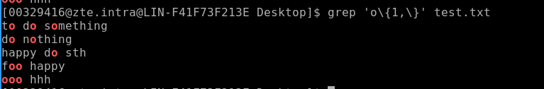

多个元素 多次匹配
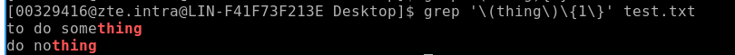
示例
```shell
test 内容
This is a test cat
to do something
do nothing
happy do sth

grep thing$ test.txt 
    to do something
    do nothing

grep -i is test.txt 
    This is a test cat
```

### grep使用 搜索内容
```shell
grep []
-i	搜索时，忽略大小写
-c	只输出匹配行的数量
-l	只列出符合匹配的文件名，不列出具体的匹配行
-n	列出所有的匹配行，显示行号
-h	查询多文件时不显示文件名
-s	不显示不存在、没有匹配文本的错误信息
-v	显示不包含匹配文本的所有行
-w	匹配整词
-x	匹配整行
-r	递归搜索
-q	禁止输出任何结果，已退出状态表示搜索是否成功
-b	打印匹配行距文件头部的偏移量，以字节为单位
-o	与-b结合使用，打印匹配的词据文件头部的偏移量，以字节为单位
```

### 进程管理

```python
ps -u | grep key 查找当前用户下 包含key关键字的进程
kill 进程号 杀死进程
sudo lsof -i:5000
    
-a	显示所有终端机下执行的程序，除了阶段作业领导者之外
a	显示现行终端机下的所有程序，包括其他用户的程序
-A	显示所有程序
-c	显示CLS和PRI栏位
c	列出程序时，显示每个程序真正的指令名称，而不包含路径，选项或常驻服务的标示
-C <指令名称>	指定执行指令的名称，并列出该指令的程序的状况
-d	显示所有程序，但不包括阶段作业领导者的程序
-e	此选项的效果和指定”A”选项相同
e	列出程序时，显示每个程序所使用的环境变量
-f	显示UID,PPIP,C与STIME栏位
f	用ASCII字符显示树状结构，表达程序间的相互关系
-g <群组名称>	此选项的效果和指定”-G”选项相同，当亦能使用阶段作业领导者的名称来指定
g	显示现行终端机下的所有程序，包括群组领导者的程序
-G <群组识别码>	列出属于该群组的程序的状况，也可使用群组名称来指定
h	不显示标题列
-H	显示树状结构，表示程序间的相互关系
-j或j	采用工作控制的格式显示程序状况
-l或l	采用详细的格式来显示程序状况
L	列出栏位的相关信息
-m或m	显示所有的执行绪
n	以数字来表示USER和WCHAN栏位
-N	显示所有的程序，除了执行ps指令终端机下的程序之外
-p <程序识别码>	指定程序识别码，并列出该程序的状况
p <程序识别码>	此选项的效果和指定”-p”选项相同，只在列表格式方面稍有差异
r	只列出现行终端机正在执行中的程序
-s <阶段作业>	指定阶段作业的程序识别码，并列出隶属该阶段作业的程序的状况
s	采用程序信号的格式显示程序状况
S	列出程序时，包括已中断的子程序资料
-t <终端机编号>	指定终端机编号，并列出属于该终端机的程序的状况
t <终端机编号>	此选项的效果和指定”-t”选项相同，只在列表格式方面稍有差异
-T	显示现行终端机下的所有程序
-u <用户识别码>	此选项的效果和指定”-U”选项相同
u	以用户为主的格式来显示程序状况
-U <用户识别码>	列出属于该用户的程序的状况，也可使用用户名称来指定
U <用户名称>	列出属于该用户的程序的状况
v	采用虚拟内存的格式显示程序状况
-V或V	显示版本信息
-w或w	采用宽阔的格式来显示程序状况
x	显示所有程序，不以终端机来区分
X	采用旧式的Linux i386登陆格式显示程序状况
-y	配合选项”-l”使用时，不显示F(flag)栏位，并以RSS栏位取代ADDR栏位
-- <程序识别码>	此选项的效果和指定”p”选项相同
--cols <每列字符数>	设置每列的最大字符数
--columns <每列字符数>	此选项的效果和指定”--cols”选项相同
--cumulative	此选项的效果和指定”S”选项相同
--deselect	此选项的效果和指定”-N”选项相同
--forest	此选项的效果和指定”f”选项相同
--headers	重复显示标题列
--help	在线帮助
--info	显示排错信息
--lines <显示列数>	设置显示画面的列数
--no-headers	此选项的效果和指定”h”选项相同，只在列表格式方面稍有差异
--group <群组名称>	此选项的效果和指定”-G”选项相同
--Group <群组识别码>	此选项的效果和指定”-G”选项相同
--pid <程序识别码>	此选项的效果和指定”-p”选项相同
--rows <显示列数>	此选项的效果和指定”--lines”选项相同
--sid <阶段作业>	此选项的效果和指定”-s”选项相同
-tty <终端机编号>	此选项的效果和指定”-t”选项相同
--user <用户名称>	此选项的效果和指定”-U”选项相同
--User <用户识别码>	此选项的效果和指定”-U”选项相同
--version	此选项的效果和指定”-V”选项相同
--widty <每列字符数>	此选项的效果和指定”-cols”选项相同
```

### 文本处理工具
#### cut
```shell
cut
-d  指定分隔符
-f  选取第几列
```

#### awk
```shell


-F 指定分隔符
-v 赋值一个用户变量
/pattern/{操作语句} pattern可以是正则也可以是判断语句
cut /etc/passwd | awk -F ":" '/^root/{print $1}'
内置变量 FILENAME NR 行号 NF 列数
```
#### sort
```shell

-b	--ignore-leading-blanks	排序时忽略起始的空白
-C	--check=quiet	不排序，如果数据无序也不要报告
-c	--check	不排序，但检查输入数据是不是已排序；未排序的话，报告
-d	--dictionary-order	仅考虑空白和字母，不考虑特殊字符
-f	--ignore-case	默认情况下，会将大写字母排在前面；这个参数会忽略大小写
-g	--general-number-sort	按通用数值来排序（跟-n不同，把值当浮点数来排序，支持科学计数法表示的值）
-i	--ignore-nonprinting	在排序时忽略不可打印字符
-k	--key=POS1[,POS2]	排序从POS1位置开始；如果指定了POS2的话，到POS2位置结束
-M	--month-sort	用三字符月份名按月份排序
-m	--merge	将两个已排序数据文件合并
-n	--numeric-sort按字符串数值来排序（并不转换为浮点数）
-o	--output=file	将排序结果写出到指定的文件中
-R	--random-sort	按随机生成的散列表的键值排序
--random-source=FILE	指定-R参数用到的随机字节的源文件
-r	--reverse	反序排序（升序变成降序）
-S	--buffer-size=SIZE	指定使用的内存大小
-s	--stable	禁用最后重排序比较
-T	--temporary-directory=DIR	指定一个位置来存储临时工作文件
-t --field-separator=SEP	指定一个用来区分键位置的字符
-u	--unique	和-c参数一起使用时，检查严格排序；不和-c参数一起用时，仅输出第一例相似的两行
-z	--zero-terminated	用NULL字符作为行尾，而不是用换行符
```
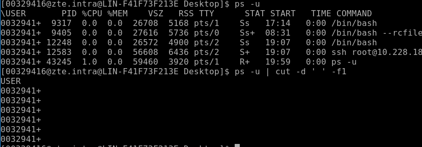

#### sed 操作
当sed处理文件路径时 使用  ;/ 即用分号作为限定符
要操作的行 (正则条件) 具体操作（s,a,i,d,c）

替换 加g变成全局替换
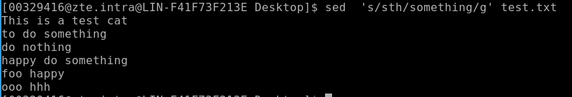

指定行替换
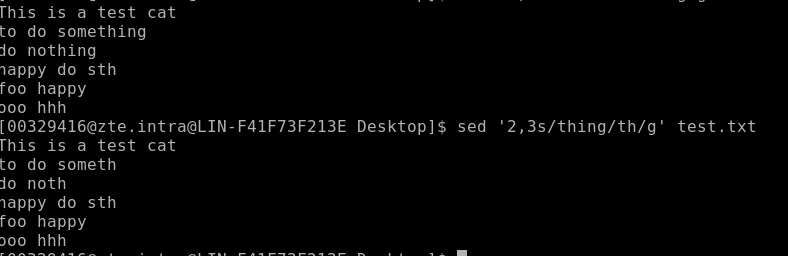
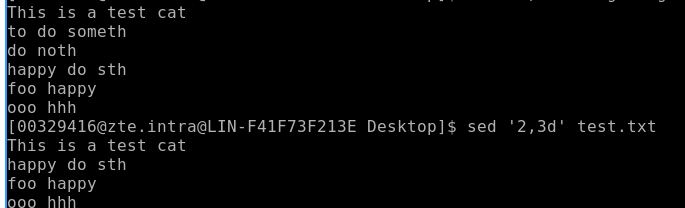

sed '/Pony/\!d' test.txt    \! 反选    /Pony/    表示正则
i 插队    a 排队
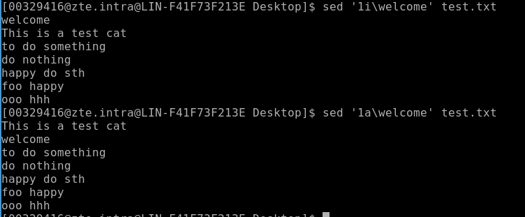
整行替换
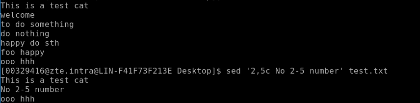

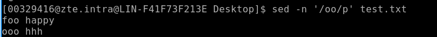
#### wc
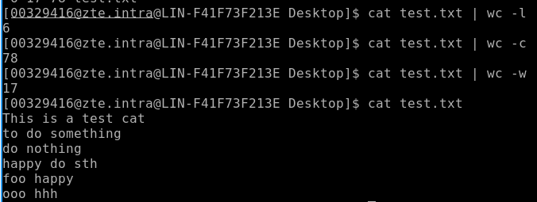
-l  行数  -w 字数 -c 字符数
#### head 和 tail
提取开头和结尾
head -n 行数 filenames
tail -n 行数 filenames
tail -f filenames   实时监控
### 用户管理

#### 增加用户

```shell
基本语法	useradd test
		   passwd  12345
c comment	给新用户添加备注
-d home_dir	为主目录指定一个名字（如果不想用登录名作为主目录名的话）
-e expire_date	用YYYY-MM-DD格式指定一个账户过期的日期
-f inactive_days	指定这个账户密码过期后多少天这个账户被禁用；0表示密码一过期就立即禁用，1表示禁用这个功能
-g initial_group	指定用户登录组的GID或组名
-G group ...指定用户除登录组之外所属的一个或多个附加组
-k	必须和-m一起使用，将/etc/skel目录的内容复制到用户的HOME目录
-m	创建用户的HOME目录
-M	不创建用户的HOME目录（当默认设置里要求创建时才使用这个选项）
-n	创建一个与用户登录名同名的新组
-r	创建系统账户
-p passwd	为用户账户指定默认密码
-s shell	指定默认的登录shell
-u uid		为账户指定唯一的UID

更改新用户默认值
useradd -D -s /bin/tsch
-b default_home	更改默认的创建用户HOME目录的位置
-e expiration_date	更改默认的新账户的过期日期
-f inactive	更改默认的新用户从密码过期到账户被禁用的天数
-g group	更改默认的组名称或GID
-s shell	更改默认的登录shell
```

#### 删除

```shell
userdel test 只删除用户和密码
-r 删除该用户的HOME目录和邮件目录
```

#### 修改

usermod 修改用户账户的字段，还可以指定主要组以及附加组的所属关系

-l修改用户账户的登录名。

-L锁定账户，使用户无法登录。

-p修改账户的密码。

-U解除锁定，使用户能够登录。

passwd	修改已有用户的密码

passwd test

输入密码

chpasswd	从文件中读取登录名密码对，并更新密码

chage	修改密码的过期日期

chfn	修改用户账户的备注信息

chsh	修改用户账户的默认登录shell

#### 切换用户

su -待登录的用户名

exit 返回之前登录的用户

#### 查询用户信息

```shell
id test
whoami 查看当前用户信息
```

#### 用户组相关操作

```shell
groupadd ttt
groupdel ttt
useradd -g ttt test 增加用户到ttt组
usermod -g 用户组 用户名 修改用户的组
usermod -g shared test 将当前用户添加到test组 前提是用户没有分配组
```

#### 变量
env     所有的环境变量 
$PATH   查看env中某个变量

##### 设置环境变量
1. 在/etc/profile文件中添加变量【对所有用户生效(永久的)】
2. 在用户目录下的.bashrc 文件中增加变量【对单一用户生效(永久的)】 
export CLASSPATH=./JAVA_HOME/lib;$JAVA_HOME/jre/lib
3. source 文件名    立即生效 

set 变量提升为全局变量
unset 变量降级为

# Shell编程

## 变量

使用 $var 可以得到变量值

$# 参数个数

​\$0 文件名   \$1第一个参数

\$* 获取全部参数 可作为整体 \$@

\$? 测试上一个命令是否执行成功 成功 0

basename 返回文件名

## 运算符

```shell
expr 1+5
expr中可以使用 +-*、<= < >= > % 
${1 + 5}
```

## 退出状态码

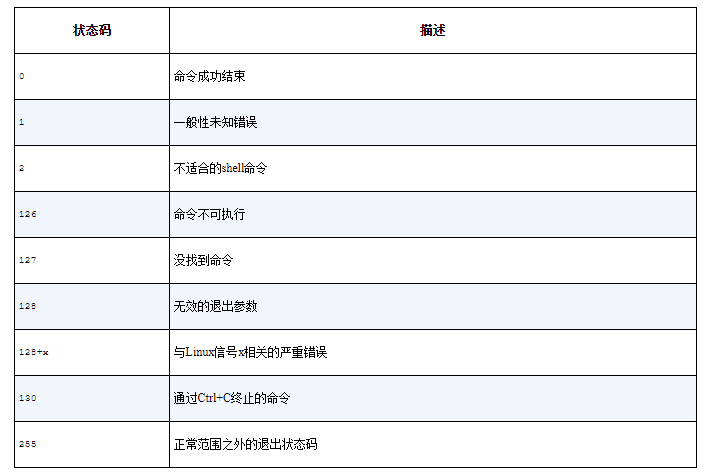

## 流程控制

### if then

条件测试 test / [ condition ]

数值比较   -eq -ne -ge -gt -le -lt 

字符串比较 != 	==	<=	 >	-n 长度大于0 		-z  长度等于0

文件类型 -d file -e  -f 

权限 -w -r -x

复合条件测试

[ condition1 ] && / || [ condition2 ]


if-then语句中使用的高级特性：

用于数学表达式的双括号（（））

（++ -- && || >> <<）

用于高级字符串处理功能的双方括号[[]]

### case

```shell
case $USER in
rich | barbara)
   echo "Welcome, $USER"
   echo "Please enjoy your visit";;
testing)
  echo "Special testing account";;
jessica)
   echo "Do not forget to log off when you're done";;
*) #default
   echo "Sorry, you are not allowed here";;
esac # ending
```

## 处理用户输入

#### 控制台读取

```shell
read -p "提示语" -s -t 5 varname # -t 限定时间 -s 隐藏输入
```

#### 文件逐行读取

```shell
count=1
cat test | while read line
do
   echo "Line $count: $line"
   count=$[ $count + 1]
done
echo "Finished processing the file"
```

## 命令替换

shell脚本中最有用的特性之一就是可以从命令输出中提取信息，并将其赋给变量。把输出赋给变量之后，就可以随意在脚本中使用了。这个特性在处理脚本数据时尤为方便。

有两种方法可以将命令输出赋给变量：

反引号字符（`）

$()格式

要注意反引号字符，这可不是用于字符串的那个普通的单引号字符。由于在shell脚本之外很少用到，你可能甚至都不知道在键盘什么地方能找到这个字符。但你必须慢慢熟悉它，因为这是许多shell脚本中的重要组件。提示：在美式键盘上，它通常和波浪线（~）位于同一键位。

命令替换允许你将shell命令的输出赋给变量。

```shell
testing=`date`
testing=$(date)
```
## awk
用于文本和数据处理的编程语言
### awk命令格式和选项
```shell
awk [options] 'script' var=value file(s)
awk [options] -f scriptfile var=value file(s)
```
-F fs fs指定输入分隔符，fs可以是字符串或正则表达式，如-F:，默认的分隔符是连续的空格或制表符
-v var=value 赋值一个用户定义变量，将外部变量传递给awk
-f scripfile 从脚本文件中读取awk命令
-m[fr] val 对val值设置内在限制，-mf选项限制分配给val的最大块数目；-mr选项限制记录的最大数目。这两个功能是Bell实验室版awk的扩展功能，在标准awk中不适用。
### awk的工作原理
awk 'BEGIN{ commands } pattern{ commands } END{ commands }'
BEGIN pattern 和 END三者可选 不是必须的
第一步执行BEGIN 语句
第二步从文件或标准输入读取一行，然后再执行pattern语句，逐行扫描文件到文件全部被读取
第三步执行END语句

### 内置变量
```shell
$0   #当前记录
$1~$n #当前记录的第N个字段
FS   #输入字段分隔符（-F相同作用）默认空格
RS   #输入记录分割符，默认换行符
NF   #字段个数就是列
NR   #记录数，就是行号，默认从1开始
OFS  #输出字段分隔符，默认空格
ORS  #输出记录分割符，默认换行符  
```
### 外部变量
```shell
[mingongge@ ~]#a=100
[mingongge@ ~]#b=100
[mingongge@ ~]#echo |awk '{print v1*v2 }' v1=$a v2=$b
10000
```
### 算术运算
说明，所有用作算术运算符 进行操作，操作数自动转为数值，所有非数值都变为0。
- 赋值运算符
= += -= *= /= %= ^= **=	赋值语句
- 逻辑运算符
||	逻辑或
&&	逻辑与
- 正则运算符
~ ~!	匹配正则表达式和不匹配正则表达式
- 关系运算符
< <= > >= != ==	关系运算符
- 算术运算符
  * \+ -	加，减
  * \*/ &	乘，除与求余
  * \ + - !	一元加，减和逻辑非
  *  ^ ***	求幂
  *  ++ --	增加或减少，作为前缀或后缀
- 其它运算符
  * $	字段引用
  * 空格	字符串连接符
  * ?:	C条件表达式
  * in	数组中是否存在某键值
